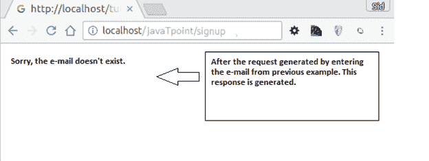

# Phalcon 反应

> 原文：<https://www.javatpoint.com/phalcon-response>

在 Phalcon 中，当产生任何请求时，用户提供手动响应或由控制器给出响应。响应文件在 **Phalcon\Http\Response** 下生成。Http 响应通常由标题和正文组成。

**例**

```php
<?php

use Phalcon\Http\Response;

// Getting a response instance
$response = new Response();

// Set status code
$response->setStatusCode(404, 'Not Found');

// Set the content of the response
$response->setContent("Sorry, the e-mail doesn't exist.");

// Send response to the client
$response->send();

```

输出



* * *

## 应对方法

| 方法 | 描述 |
| 公共 setDI(Phalcon \ Diinterface $ dependency injector) | 设置依赖注入器 |
| 公共 getDI() | 返回内部依赖注入器。 |
| 公共 setStatusCode(混合$代码，[混合$消息] | 设置 HTTP 响应代码。 |
| public getstatuscode 代码() | 返回状态代码。 |
| 公共集合头(Phalcon \ Http \ Response \ header interface $头) | 为外部响应设置头包。 |
| 公共 getHeaders() | 返回用户设置的标题。 |
| 公共 setCooKies(Phalcon \ Http \ Response \ CooKies interface $ CooKies) | 为外部响应设置 cookies 包。 |
| 公共 Phalcon \ Http \ Response \ CooKies interface GetCooKies() | 返回用户设置的 cookies。 |
| 公共重置者() | 重置所有已建立的标头。 |
| public set expires(datetime $ datetime) | 在响应中设置允许使用 HTTP 缓存的过期标头。 |
| public setNotModified() | 发送未修改响应。 |
| 公共集合内容类型(混合$内容类型、[混合$字符集]) | 设置响应内容类型 mime，可选字符集。 |
| 公共 setEtag(混合$etag) | 设置自定义 ETag。 |
| 公共集合内容(混合$内容) | 设置 HTTP 响应正文。 |
| public getContent() | 获取 HTTP 响应正文。 |