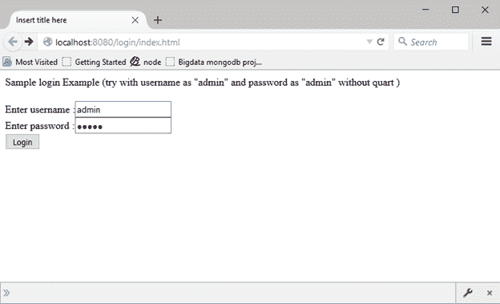

# Phalcon 安全公司

> 原文：<https://www.javatpoint.com/phalcon-password-hashing>

Phalcon 为开发人员提供常见的安全任务，例如:

*   **密码哈希**。
*   **跨站点请求伪造保护(CSRF)** 。

* * *

## 密码哈希

这是一种将密码以加密形式存储在数据库中的技术。如果密码以纯文本格式存储，那么任何能够访问数据库的入侵者都可以轻松查看密码。

为了避免这个问题，密码散列有两种技术:

*   **md5:** 它将纯文本转换为 32 个字符的十六进制数字的散列。
*   **sha1:** 它将纯文本转换为 40 个字符的十六进制数字的散列。

**例**

**参见使用 md5 技术的密码散列示例:**

```php
<?php

use Phalcon\Mvc\Controller;

class UsersController extends Controller
{
    public function registerAction()
    {
        $user = new Users();

        $login    = $this->request->getPost('login');
        $password = $this->request->getPost('password');

if ($user === false) { 
            $this->flash->error("Incorrect credentials"); 
            return $this->dispatcher->forward(array( 
               'controller' => 'users', 'action' => 'index' 
            )); 
         } 
         $this->session->set('auth', $user->id);  
         $this->flash->success("You've been successfully logged in");

        $user->login = $login;

        // Store the password hashed
        $user->password = $this->security->hash($password);

        $user->save();
    }
}

```

输出:



**成功登录数据库后，我们可以看到以哈希格式存储的密码:**

