# 在 Linux 中安装

> 原文:[https://www.javatpoint.com/yii-installation-in-linux](https://www.javatpoint.com/yii-installation-in-linux)

我们正在通过 Composer 安装我们的 Yii2 框架。所以首先我们需要在我们的 Linux 系统上安装 composer。

为了在我们的系统中使用 composer Yii2，需要首先安装一些软件包来支持它们。

让我们开始吧。打开您的终端并开始执行以下代码。

* * *

## 安装 Composer 和 Yii2 框架的先决条件

**第一步****卷曲**安装

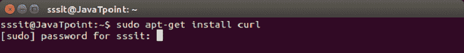

**第 2 步****PHP 5-CLI 软件包**安装

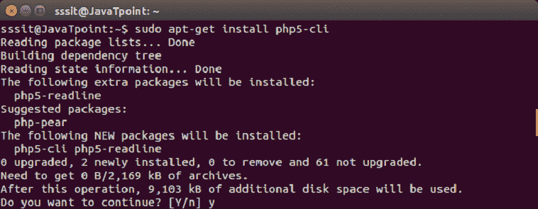

看上面的快照，是在征求许可，按 **y** 然后**进入。**

**第三步****php5-MySQL 包**安装

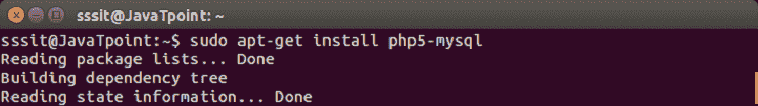

**第 4 步****PHP 5-my crypt 包**安装

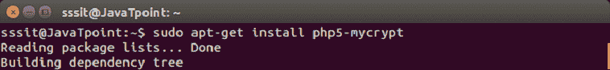

要激活它，我们需要运行以下命令。

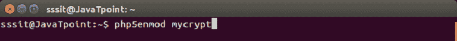

现在这四个包将一直保留在你的系统中，你不需要每次安装 Yii 框架时都安装它们。

* * *

## yi 安装

让我们在我们的系统中全局安装作曲者。

**第 1 步****作曲家**安装

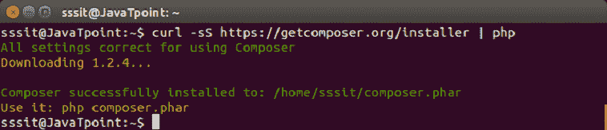

**步骤 2** 在全球范围内安装**作曲家**

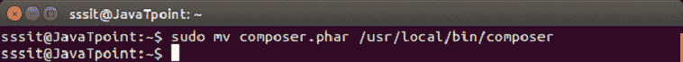

**步骤 3**composer 安装完毕后，安装 composer 资产插件。

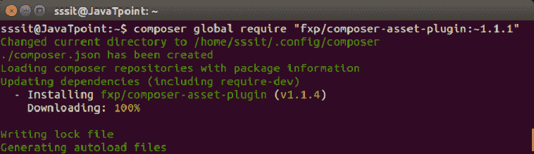

在这里，您可能需要一个**令牌**，它指示 **GitHub** 用户名和密码。如果你没有，就创建它。它非常容易创建和免费使用。

该命令允许您管理资产插件，如 css、js 等，这些插件管理 **npm** 和 **bower** 依赖项。

现在我们准备安装基本和高级模板。

**步骤 4** 安装**基础模板**

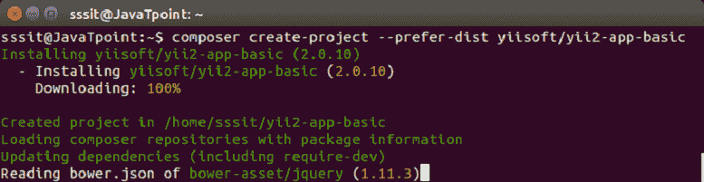

下载完成后，您可以根据需要对其进行重命名。我们的文件夹命名为 **basic。**

**步骤 5** 安装**高级模板**

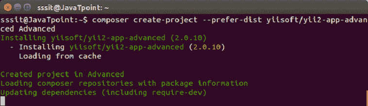

这里我们将其命名为 **Advanced。**

**第六步**在浏览器上运行，网址如下:

**http://localhost/Advanced/front/web/**

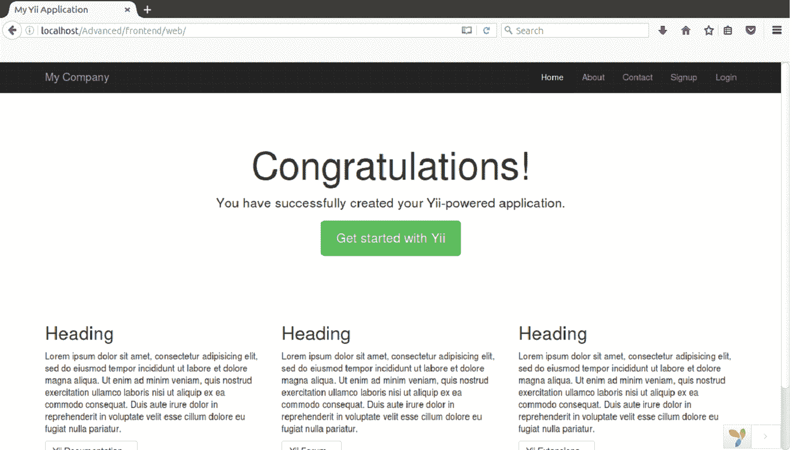

看上面的快照，你已经在你的系统中成功下载了你的 Yii2 框架。现在开始你的申请。