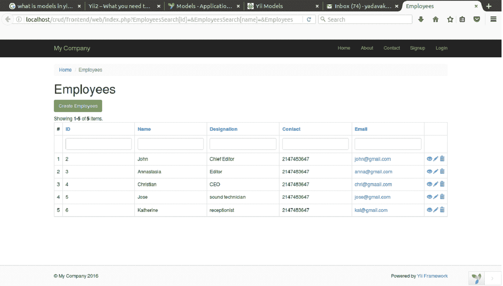
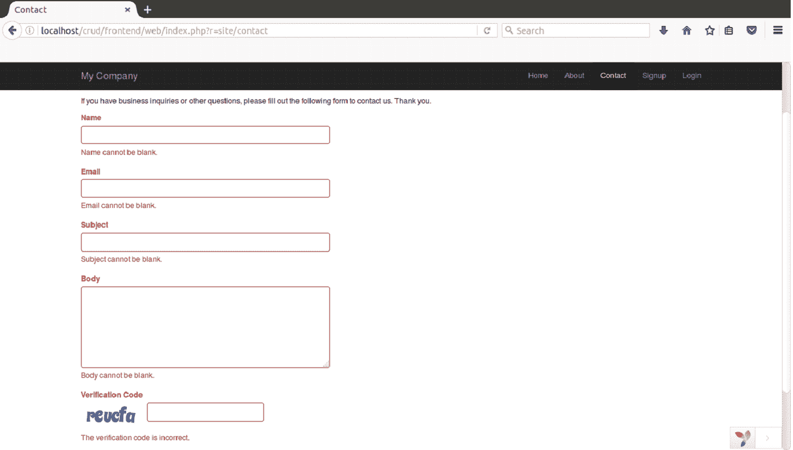
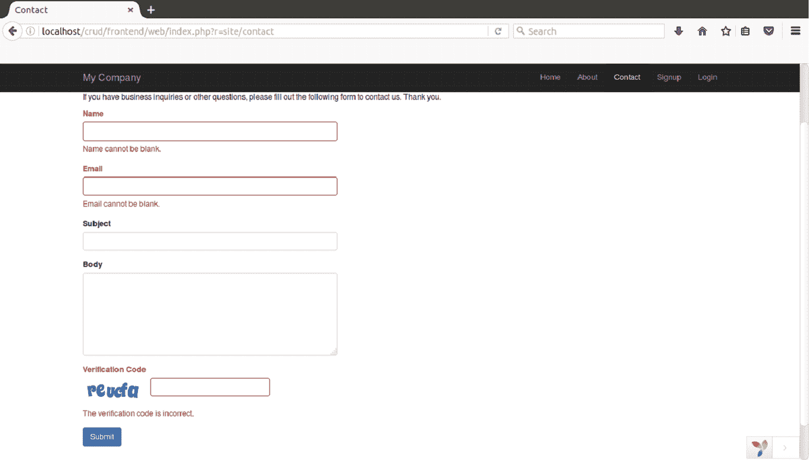

# Yii 模型

> 原文：<https://www.javatpoint.com/yii-models>

模型是 MVC 结构的一部分。它们代表应用程序的规则和逻辑。意味着它们保存数据并定义数据的验证规则。

模型类由 **yii\base\Model** 或其子类扩展。

主要有以下特性是使用模型实现的。

*   属性声明
*   属性标签
*   海量属性分配
*   基于场景的验证
*   不能嵌入 HTML
*   无法直接访问

* * *

## 属性

属性主要表示业务数据。每个属性都是模型的公共可访问属性。它们可以像数组元素或普通对象属性一样被访问。这就像一个模型的可公开访问的属性。

该方法，

```php

yii\base\Model::attributes() 

```

指定模型类具有哪些属性。

模型类也是 ActiveRecord 类的基类(它是一个具有附加功能的高级模型)。

作为普通对象属性的属性:

```php
$model = new \app\models\ContactForm;

// "name" is an attribute of ContactForm
$model->name = 'example';
echo $model->name;

Attribute as array elements:

$model = new \app\models\ContactForm;

// accessing attributes like array elements
$model['name'] = 'example';
echo $model['name'];

// Model is traversable using foreach.
foreach ($model as $name => $value) {
    echo "$name: $value\n";
}

```

在 Yii 的早期版本中，场景和验证是用相同的功能处理的。但是在 Yii2 中，它们被分成不同的功能，即:规则()和场景()。

这里，规则()指定数据的验证，而场景()指定哪些属性可以安全地分配给模型。

* * *

## 属性标签

属性标签是与属性一起显示以获取用户输入的值。

例如，在下面的代码中，标识、姓名、名称、联系人和电子邮件表示属性标签。所有这些都是在一个函数 attributeLabels()下定义的。

```php
public function attributeLabels() 
    { 
        return [ 
            'id' => 'ID', 
            'name' => 'Name', 
            'designation' => 'Designation', 
            'contact' => 'Contact', 
            'email' => 'Email', 
        ]; 
    }

```



看上面的快照，标题数据表示属性标签。

## 情节

一个模型可以用于不同的场景。例如，模型可以用于收集登录用户输入，同时它也可以用于收集新用户的输入以进行注册。因此，在不同的场景中，模型可能使用不同的规则和逻辑。

**例**

这是**ContactForm.php**代码，

```php
<?php 
   namespace frontend\models; 
   use Yii; 
   use yii\base\Model; 
   /** 
   * ContactForm is the model behind the contact form. 
   */ 
   class ContactForm extends Model { 
      public $name; 
      public $email; 
      public $subject; 
      public $body; 
      public $verifyCode; 
       const SCENARIO_EMAIL_FROM_GUEST = 'EMAIL_FROM_GUEST'; 
      const SCENARIO_EMAIL_FROM_USER = 'EMAIL_FROM_USER'; 

      public function scenarios() { 
         return [ 
            self::SCENARIO_EMAIL_FROM_GUEST => ['name', 'email', 'subject', 
               'body', 'verifyCode'], 
            self::SCENARIO_EMAIL_FROM_USER => ['name', 'email' ,'subject', 'body', 
               'verifyCode'], 
         ]; 
      } 
      /** 
      * @return array the validation rules. 
      */ 
      public function rules() { 
         return [ 
            // name, email, subject and body are required 
            [['name', 'email', 'subject', 'body'], 'required'], 
            // email has to be a valid email address 
            ['email', 'email'], 
            // verifyCode needs to be entered correctly 
            ['verifyCode', 'captcha'], 
         ]; 
      } 
      /** 
      * @return array customized attribute labels 
      */ 
      public function attributeLabels() { 
         return [ 
           'name' => 'Name', 
            'email' => 'Email', 
            'subject' => 'Subject', 
            'body' => 'Body', 
            'verifyCode' => 'Verification Code', 
         ]; 
      } 
      /** 
      * Sends an email to the specified email address using the information 
         collected by this model. 
      * @param  string  $email the target email address 
      * @return boolean whether the model passes validation 
      */ 
      public function contact($email) { 
         if ($this -> validate()) { 
            Yii::$app->mailer->compose() 
               ->setTo($email) 
               ->setFrom([$this->email => $this->name]) 
               ->setSubject($this->subject) 
               ->setTextBody($this->body) 
               ->send(); 
            return true; 
         } 
         return false; 
      } 
   } 
?>

```

创建一个动作**动作联系**SiteController.php**文件中的**

```php

  public function actionContact() { 
   $model = new ContactForm(); 
   $model->scenario = ContactForm::SCENARIO_EMAIL_FROM_GUEST; 
   if ($model->load(Yii::$app->request->post()) && $model-> 
      contact(Yii::$app->params ['adminEmail'])) { 
         Yii::$app->session->setFlash('contactFormSubmitted');  
         return $this->refresh(); 
   } 
   return $this->render('contact', [ 
      'model' => $model, 
   ]); 
}

```

现在，我们将在浏览器中运行程序，



现在更改**动作中的场景联系**SiteController.php**中的**如下

```php
$model->scenario = ContactForm::SCENARIO_EMAIL_FROM_USER;

```

现在在浏览器中运行程序时，主题和正文字段将不再是必填字段。



## 验证规则

这些是为用户要完成的字段设置的规则。例如，必需的规则将确保相应的字段不为空。电子邮件属性将确保输入的电子邮件是有效的电子邮件。如果值不符合规则，屏幕上将出现一条错误消息。

要为所有场景中的所有字段声明验证规则，请使用以下代码。

```php
public function rules()
{
    return [
        // the name, email, subject and body attributes are required
        [['name', 'email', 'subject', 'body'], 'required'],

        // the email attribute should be a valid email address
        ['email', 'email'],
    ];
}

To declare different validation rules for different scenarios, use the following code.

public function rules()
{
    return [
        // username, email and password are all required in "register" scenario
        [['username', 'email', 'password', 'd_o_b'], 'required', 'on' => self::SCENARIO_REGISTER],

        // username and password are required in "login" scenario
        [['username', 'password'], 'required', 'on' => self::SCENARIO_LOGIN],
    ];
}

```

属性上的**实现了该规则将应用于特定场景。如果您不在**属性上使用**，默认情况下，该规则将应用于所有字段。**

* * *

## 大量任务

在大规模赋值中，使用一行代码用用户输入填充模型。大量赋值只适用于安全属性。

看看下面两种类型的代码，它们都将最终用户提交的表单数据分配给 ContactForm 模型的属性。

首先是，

```php
$model = new \app\models\ContactForm;
$model->attributes = \Yii::$app->request->post('ContactForm');
Second one is,

$model = new \app\models\ContactForm;
$data = \Yii::$app->request->post('ContactForm', []);
$model->name = isset($data['name']) ? $data['name'] : null;
$model->email = isset($data['email']) ? $data['email'] : null;
$model->subject = isset($data['subject']) ? $data['subject'] : null;
$model->body = isset($data['body']) ? $data['body'] : null;

```

第一种使用大量赋值的方法更容易，更简洁，更不容易出错。