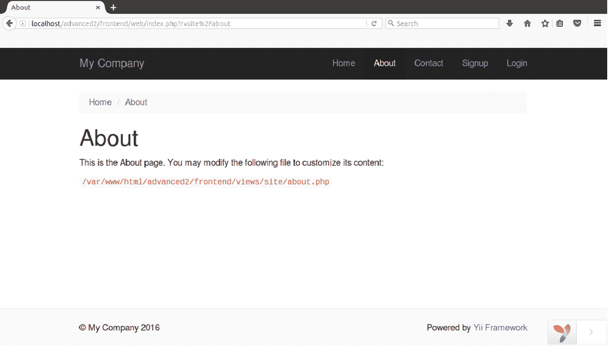
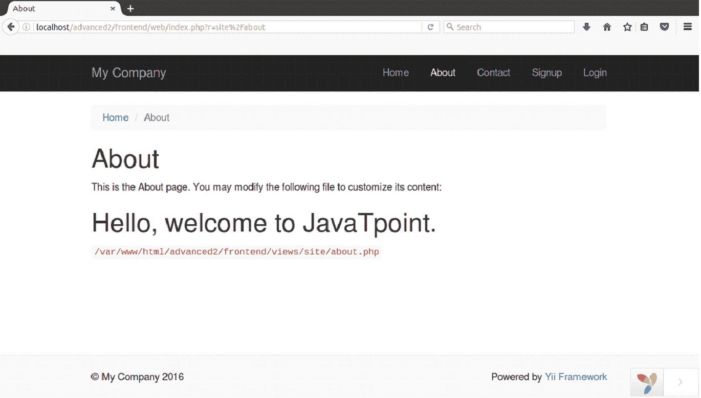

# 视图

> 原文：<https://www.javatpoint.com/yii-views>

MVC 结构中的视图部分负责在用户面前呈现数据。它们主要包含 HTML 内容和表现性的 PHP 代码。

* * *

## 创建视图

看基础 Yii 页面的**关于**页面代码。

```php
<?php 

/* @var $this yii\web\View */ 

use yii\helpers\Html; 

$this->title = 'About'; 
$this->params['breadcrumbs'][] = $this->title; 
?> 
<div class="site-about"> 
    <h1><?= Html::encode($this->title) ?></h1> 

    <p>This is the About page. You may modify the following file to customize its content:</p> 

    <code><?= __FILE__ ?></code> 
</div> 

```

它的输出是:



在上面的脚本中，PHP 代码用于生成标题和表单标签内部的动态内容。HTML 标记在演示视图中显示数据。

* * *

## 查看约定

*   控制器渲染的视图应写入**@ app/view/controller id**文件夹。
*   小部件渲染的视图应该写入**widgetPath/view**文件夹。

可以调用以下控制器方法在控制器内呈现视图:

*   **渲染()**:渲染上述视图文件并应用布局。
*   **渲染局部()**:渲染上述视图，但不应用布局。
*   **renderAjax()** :渲染没有布局的视图，并注入所有注册的 JS 脚本和 CSS 文件。
*   **渲染文件()**:在指定路径渲染视图文件。
*   **渲染内容()**:渲染静态环。

可以调用以下控制器方法在另一个视图中呈现视图:

*   **渲染()**:渲染视图页面。
*   **renderAjax()** :渲染没有布局的视图，并注入所有注册的 JS 脚本和 CSS 文件。
*   **渲染文件()**:在指定路径渲染视图文件。

可以调用以下控制器方法来呈现小部件内的视图:

*   **渲染()**:渲染视图页面。
*   **渲染文件()**:在指定路径渲染视图文件。

**示例:**

**步骤 1** 在**视图/站点**文件夹中，我们正在创建一个视图文件**exm.php**文件。

```php
<!DOCTYPE html> 
<html> 
<head> 
	<title></title> 
</head> 
<body> 
	<h1>Hello, welcome to JavaTpoint.</h1> 
</body> 
</html>

```

**第 2 步**渲染**exm.php**在**about.php**查看文件在站点文件夹。

```php
<?php 

/* @var $this yii\web\View */ 

use yii\helpers\Html; 

$this->title = 'About'; 
$this->params['breadcrumbs'][] = $this->title; 
?> 
<div class="site-about"> 
    <h1><?= Html::encode($this->title) ?></h1> 

    <p>This is the About page. You may modify the following file to customize its content:</p> 

     <?= $this->render("exm") ?> 

    <code><?= __FILE__ ?></code> 
</div> 

```

**第三步**在浏览器上运行。

