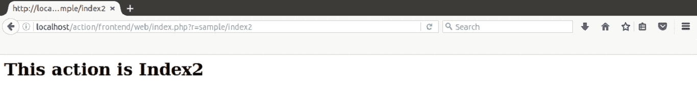
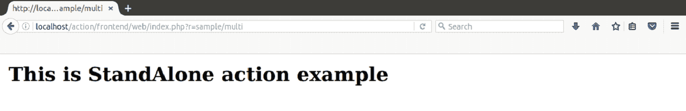
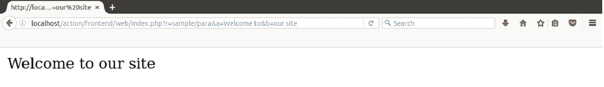

# 控制器动作

> 原文：<https://www.javatpoint.com/yii-controllers-action>

操作在控制器文件中定义。它们需要在通过 URL 执行应用程序中的请求时被调用。

* * *

## 创建操作

通过定义一个名称以单词 **action 开头的公共方法来创建一个操作。**

**示例:**

**步骤 1** 我们将在**SampleController.php**文件中创建一个名为**索引 2** 的动作。

```php
<?php 
namespace frontend\controllers; 

use Yii; 
use yii\web\Controller; 

class SampleController extends Controller 
{ 
    public function actionIndex() 
    { 
      return $this->render('index'); 
    } 

    public function actionIndex2() 
    { 
         return "<h1>This action is Index2</h2>"; 
    } 
} 
?>

```

**第二步**在浏览器上运行。

**http://localhost/action/frontend/web/index . PHP？r =样本/索引 2**



* * *

## 操作标识

创建一个操作来执行一个特定的请求，因此它通常被命名为动词，如创建、查看、更新、删除等。

操作标识只能包含以下字母:

*   小写英文字母
*   强调
*   连字符
*   在上面的例子中，英文字母后面的数字就像索引 2。

可以通过两种方式创建操作:

*   内嵌动作
*   独立操作

* * *

## 内联操作

内联操作是控制器类中的一种方法。这些是最常创建的动作，它们不需要使用多次，并且很容易创建。

根据以下几点定义内联操作标识名称:

*   以**动作**前缀开始方法名称。
*   动作后单词的第一个字母会大写。
*   删除连字符。

例如，

*   索引 2 变成动作索引 2
*   登录表单变为操作登录表单

* * *

## 独立操作

独立动作扩展 **yii\base\Action** 或其子类。这些操作主要是在需要在不同的控制器中使用或作为扩展重新分发时创建的。

它们可以被定义为单独的类，然后将它们连接到您的控制器。这样他们就能重复使用。

这些动作必须实现一个名为 **run()** 的方法，并扩展到 **yii\base\Action** 或一个子类。

**例**

我们将演示独立操作的简单用法。

**步骤 1** 在你的 Yii2 文件夹的前端目录中创建一个文件夹**站**。

**步骤 2** 现在在上面创建的文件夹中创建一个**MultiAction.php**文件。

```php
<?php 
   namespace frontend\standing; 
   use yii\base\Action; 
   class MultiAction extends Action { 
      public function run() { 
         return "<h3>This is StandAlone action example</h3>"; 
      } 
   } 
?>

```

看看上面的代码，我们已经创建了一个名为**多动作**的独立动作，它扩展到了动作类。已经实现了 run()方法。

**第三步**在上面创建的**SampleController.php**文件中添加一些额外的代码。

```php
<?php 
namespace frontend\controllers; 

use Yii; 
use yii\web\Controller; 

class SampleController extends Controller 
{ 

    public function actionIndex() 
    { 
      return $this->render('index'); 
    } 

     public function actions()
     { 
         return [ 
            'multi' => 'frontend\standing\MultiAction', 
         ]; 
      } 

    public function actionIndex2() 
    { 
         return "<h1>This action is Index2</h2>"; 
    } 
} 
?>

```

看上面的代码，actions()方法返回的独立操作是在 standing 文件夹中创建的**多**操作。

**第四步**用网址在浏览器上运行，

**http://localhost/action/frontend/web/index . PHP？r =样本/多**



* * *

## 动作返回值

动作的返回值代表相应动作的结果。

下面的示例显示了一个通过返回响应对象重定向到新网址的操作。 **redirect()** 方法总是返回一个响应对象。

**步骤 1** 在**SampleController.php**文件中添加以下代码。

```php
public function actionMysite() 
{ 
    // redirect the user browser to http://example.com 
    return $this->redirect('http://javatpoint.com'); 
}

```

**第二步**在浏览器上运行，网址如下:

**http://localhost/action/frontend/web/index . PHP？r =样品/mysite**

上述网址将导致 javatpoint.com 网站在你面前。

* * *

## 动作参数

您还可以向操作方法添加参数。它们的值将使用参数名作为关键字从$_GET 方法中检索。

**步骤 1** 在**SampleController.php**文件中添加以下代码。

```php

public function actionPara($a, $b) 
    { 
   		return "$a $b"; 
	} 

```

**第二步**在浏览器上运行，网址如下:

**http://localhost/action/frontend/web/index . PHP？r =样本/段落&a =欢迎来到&b =我们的网站**



在上面的网址中，如果你不给 **a** 和 **b** 变量提供任何值，就会抛出异常错误。

## 默认操作

默认操作总是在每个控制器文件中指定。默认设置为**索引。**

当在路由中，网址只包含控制器标识时，它将转到默认操作，即索引。但是，这个默认值可以通过重写来更改。

命名空间 app \控制器；

使用 yii \ web \控制器；

```php
class SiteController extends Controller
{
    public $defaultAction = 'main_page';

    public function actionHome()
    {
        return $this->render('main_page');
    }
}

```

[download this example](https://static.javatpoint.com/yii/src/action.zip)