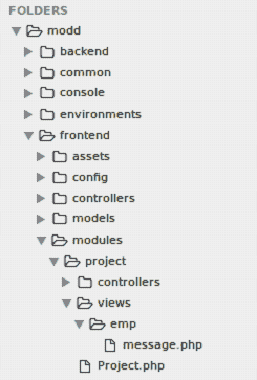
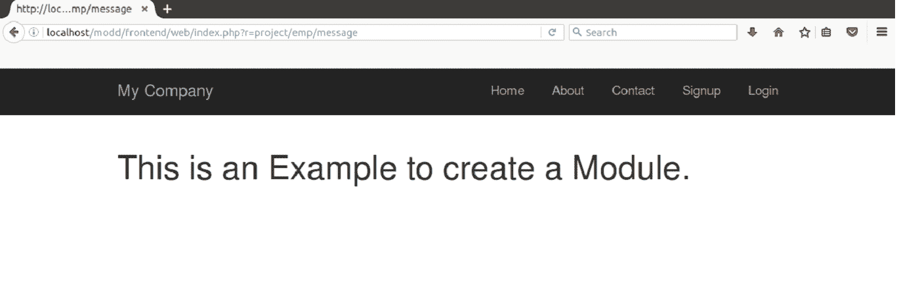

# 模块

> 原文：<https://www.javatpoint.com/yii-modules>

模块驻留在主应用程序中，并被组织为一个目录，称为模块的基本路径。这个模块目录将有自己的 MVC(模型、视图和控制器)和其他支持组件，就像一个应用程序一样。

* * *

## 模块结构

模块遵循如下所示的典型结构。

```php

newModule/
    Module.php                   the module class file
    controllers/                 containing controller class files
        DefaultController.php    the default controller class file
    models/                      containing model class files
    views/                       containing controller view and layout files
        layouts/                 containing layout view files
        default/                 containing view files for DefaultController
            index.php            the index view file

```

## 模块类

模块类别特征:

*   每个模块应该有一个唯一的类扩展到 **yii\base\Module。**
*   类应该位于模块的基本路径下，并且应该是可访问的。
*   执行时，将创建模块类的单个实例。
*   模块实例用于共享模块内代码的数据和组件。
*   默认情况下，它被命名为 Module.php。

**例**

让我们看一个创建模块的例子。

**步骤 1** 在你的 Yii2 文件夹的**前端**目录中创建**模块**命名文件夹。

**步骤 2** 在模块文件夹内创建一个名为**项目的文件夹。**

**步骤 3** 在项目文件夹内创建一个名为**Project.php 的文件。**

```php
<?php 

namespace frontend\modules\project; 

/** 
 * project module definition class 
 */ 
class Project extends \yii\base\Module 
{ 
    /** 
     * @inheritdoc 
     */ 
    public $controllerNamespace = 'frontend\modules\project\controllers'; 

    /** 
     * @inheritdoc 
     */ 
    public function init() 
    { 
        parent::init(); 

        // custom initialization code goes here 
    } 
} 

```

看看上面的代码，这是我们创建的模块类。这里的 **init()** 功能是初始化模块的属性。

**步骤 4** 在项目文件夹内创建两个名为**控制器**和**视图的文件夹。**

**步骤 5** 在**控制器**文件夹**内创建 EmpController.php**文件。

```php
<?php 

namespace frontend\modules\project\controllers; 

use yii\web\Controller; 

/** 
 * Default controller for the `project` module 
 */ 
class EmpController extends Controller 
{ 
    /** 
     * Renders the index view for the module 
     * @return string 
     */ 
    public function actionMessage() 
    { 
        return $this->render('message'); 
    } 
} 

```

看上面的快照，这里我们已经定义了动作 **actionMessage。**

**第 6 步**在**视图**文件夹中创建 **emp** 文件夹，并在其中创建**message.php**文件。

# 这是一个创建模块的示例。

下面的快照显示了我们 modd 目录中最终模块的结构。它显示在**modd/前端/模块**目录中创建的所有文件。



**第 7 步**现在我们需要做一些配置设置来添加我们的模块。转到前端目录的**配置**文件夹。

在配置文件夹的文件**main.php**中添加模块。

```php
<?php 
$params = array_merge( 
    require(__DIR__ . '/../../common/config/params.php'), 
    require(__DIR__ . '/../../common/config/params-local.php'), 
    require(__DIR__ . '/params.php'), 
    require(__DIR__ . '/params-local.php') 
); 

return [ 
    'id' => 'app-frontend', 
    'basePath' => dirname(__DIR__), 
    'bootstrap' => ['log'], 
    'controllerNamespace' => 'frontend\controllers', 
     'modules' => [ 
        'project' =>[ 
            'class' => 'frontend\modules\project\Project', 
       ], 
    ], 
    'components' => [ 
        'request' => [ 
            'csrfParam' => '_csrf-frontend', 
        ], 
        'user' => [ 
            'identityClass' => 'common\models\User', 
            'enableAutoLogin' => true, 
            'identityCookie' => ['name' => '_identity-frontend', 'httpOnly' => true], 
        ], 
        'session' => [ 
            // this is the name of the session cookie used for login on the frontend 
            'name' => 'advanced-frontend', 
        ], 
        'log' => [ 
            'traceLevel' => YII_DEBUG ? 3 : 0, 
            'targets' => [ 
                [ 
                    'class' => 'yii\log\FileTarget', 
                    'levels' => ['error', 'warning'], 
                ], 
            ], 
        ], 
        'errorHandler' => [ 
            'errorAction' => 'site/error', 
        ], 
        /* 
        'urlManager' => [ 
            'enablePrettyUrl' => true, 
            'showScriptName' => false, 
            'rules' => [ 
            ], 
        ], 
        */ 
    ], 
    'params' => $params, 
]; 

```

**第 8 步**在浏览器上运行，网址如下:

**http://localhost/modd/frontend/web/index . PHP？r =项目/EMP/消息**



* * *

## 要点:

*   模块应该用于大型应用程序。将其功能分成几个组，并将其开发为一个模块。
*   模块应该可以在未来的项目中重用。

[download this example](https://static.javatpoint.com/yii/src/modd.zip)