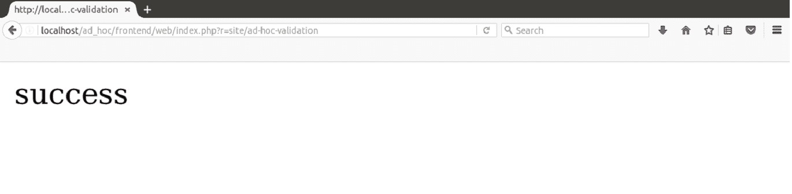

# 临时验证

> 原文:[https://www.javatpoint.com/yii-ad-hoc-validation](https://www.javatpoint.com/yii-ad-hoc-validation)

为了验证没有绑定到任何模型的值，我们需要使用特别验证。或者，如果您想在没有模型的情况下验证值，则使用特别验证。

要执行一种类型的验证，您可以调用所需验证器的**yii \ validators \ validator()**方法。

并非所有的 valdiators 都支持这种类型的验证。

例如，我们正在调用**yii \验证器\日期验证器()**

```php
$date = '24th November 2016, Thursday';
	$validator = new yii\validators\DateValidator();

	if ($validator->validate($date, $error)) {
    	echo 'Date is valid.';
	} else {
    	echo $error;
	}

```

但是要对几个值执行多个验证，您可以使用定义属性和规则的 **yii\base\DynamicModel** 。

**例如**，这里我们调用 DynamicModel 来验证日期和邮件。

```php
public function actionAdHocValidation() { 
   	$model = DynamicModel::validateData([ 
      	'date' => '24th November 2016, Thursday', 
     	 'email' => 'abc@gmail.com' 
   	], [ 
      	[['date', 'email'], 'string', 'max' => 40], 
  	 ]); 

   	if ($model->hasErrors()) { 
      	var_dump($model->errors); 
   	} else { 
      	echo "success"; 
   	} 
	}

```

在浏览器上，传递网址

**http://localhost/ad _ ad hoc/frontend/web/index . PHP？r =现场/临时验证**



看看上面的输出，日期和电子邮件都同时被验证了。