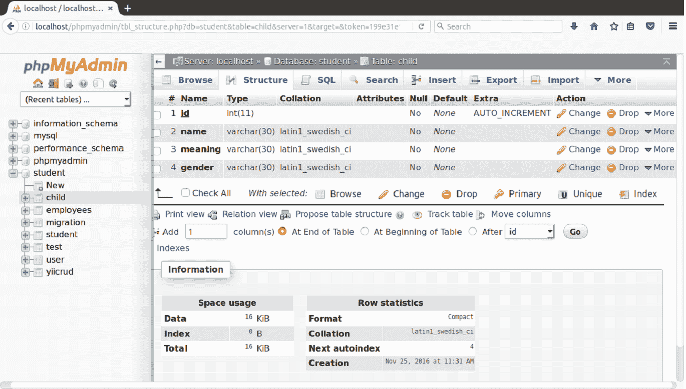

# 创建数据库

> 原文:[https://www.javatpoint.com/yii-creating-database](https://www.javatpoint.com/yii-creating-database)

之前我们用 yii 的 Gii 生成工具执行了 CRUD 操作。现在我们将在没有 Gii 的情况下执行 CRUD。

我们将在这里执行一个完整的 CRUD 操作。

我们 Yii2 文件夹的名字是 **dbb。**

我们创建了一个名为**学生**的数据库和一个名为**孩子的表。**



看上面的快照，这是我们表的结构。

* * *

## 数据库配置

要在 Yii2 中配置您的数据库，请转到**common/config/main-local . PHP**文件并写入您的数据库名称。

我们已经把**学生**写成了我们数据库的名字。

```php
<?php 
return [ 
    'components' => [ 
        'db' => [ 
            'class' => 'yii\db\Connection', 
            'dsn' => 'mysql:host=localhost;dbname=student', 
            'username' => 'root', 
            'password' => 'mysql', 
            'charset' => 'utf8', 
       ], 
        'mailer' => [ 
            'class' => 'yii\swiftmailer\Mailer', 
            'viewPath' => '@common/mail', 
            // send all mails to a file by default. You have to set 
            // 'useFileTransport' to false and configure a transport 
            // for the mailer to send real emails. 
            'useFileTransport' => true, 
        ], 
    ], 
]; 

```