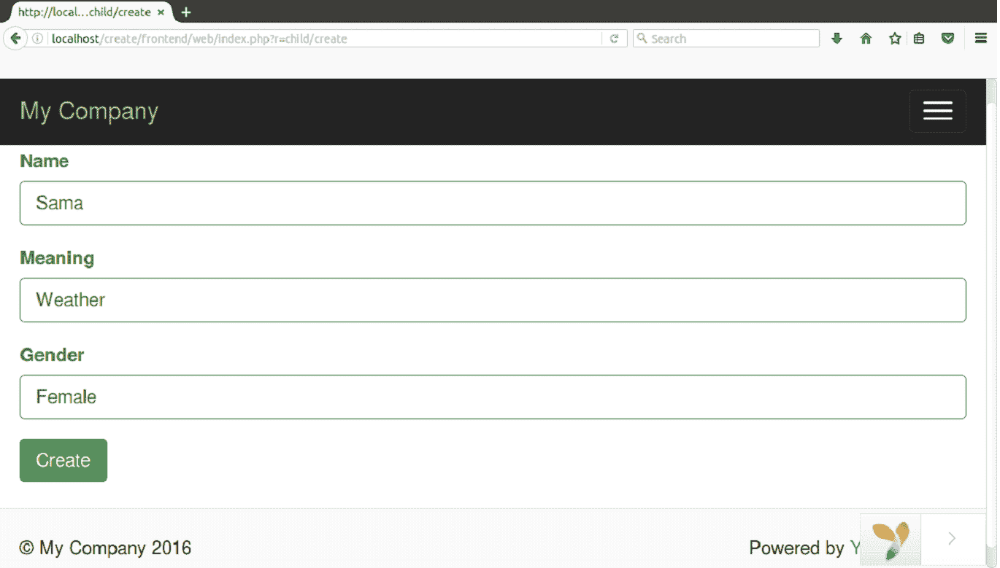

# 创建(插入)记录

> 原文：<https://www.javatpoint.com/yii-insert-record>

要在数据库中插入记录，有以下步骤。我们已经将我们的 Yii2 文件夹命名为 **create。**

**步骤 1 创建模型文件**

在**前端/模型**文件夹中创建模型文件**child.php**。

```php
<?php 
namespace app\models; 

use Yii; 

class Child extends \yii\db\ActiveRecord 
{ 
    /** 
     * @inheritdoc 
     */ 
    public static function tableName() 
    { 
        return 'child'; 
    } 

    /** 
     * @inheritdoc 
     */ 
    public function rules() 
    { 
        return [ 
            [['name', 'meaning', 'gender'], 'required'], 
            [['name', 'meaning'], 'string', 'max' => 100], 
            [['gender'], 'string', 'max' => 15] 
        ]; 
    } 
}

```

看看上面的代码，

*   \yii\db\ActiveRecord 用于创建模型文件。
*   在函数 tableName 中，输入您正在使用的表名。
*   函数规则定义了表的输入。

**步骤 2 创建控制器文件**

在**前端/控制器**文件夹中创建控制器文件**ChildController.php**。

```php

<?php 
namespace frontend\controllers; 

use Yii; 
use app\models\Child; 
use yii\web\Controller; 

/** 
 * manual CRUD 
 **/ 
class ChildController extends Controller 
{  
    /** 
     * Create 
     */ 
    public function actionCreate() 
    { 

        $model = new Child(); 

        // new record 
        if($model->load(Yii::$app->request->post()) && $model->save()){ 
            return $this->redirect(['index']); 
        } 

        return $this->render('create', ['model' => $model]); 
    }
    }

```

**步骤 3 创建视图文件**

在**前端/视图**文件夹中创建视图文件夹**子级**。然后在**前端/视图/子**文件夹中创建一个文件**create.php**。

```php
<?= $this->render('child_view', [ 
    'model' => $model, 
]) ?>

```

现在在**前端/视图/子**文件夹中创建一个文件 **child_view.php** 。

```php
<?php 
use yii\helpers\Html; 
use yii\widgets\ActiveForm; 
?> 

<?php $form = ActiveForm::begin(); ?> 

    <?= $form->field($model, 'name'); ?> 
    <?= $form->field($model, 'meaning'); ?> 
    <?= $form->field($model, 'gender'); ?> 

    <?= Html::submitButton($model->isNewRecord ? 'Create' : 'Update', ['class' => $model-> 
     isNewRecord ? 'btn btn-success' : 'btn btn-primary']); ?> 

   <?php ActiveForm::end(); ?>

```

**第四步运行**

现在使用以下网址在浏览器上运行您的应用程序。

**http://localhost/create/frontend/web/index . PHP？r =子/创建**



看上面的图标，填写完所有字段后，点击**创建**按钮，您的数据将被插入数据库。

你可以从你的 phpmyadmin 在数据库中检查它。

[download this example](https://static.javatpoint.com/yii/src/create.zip)