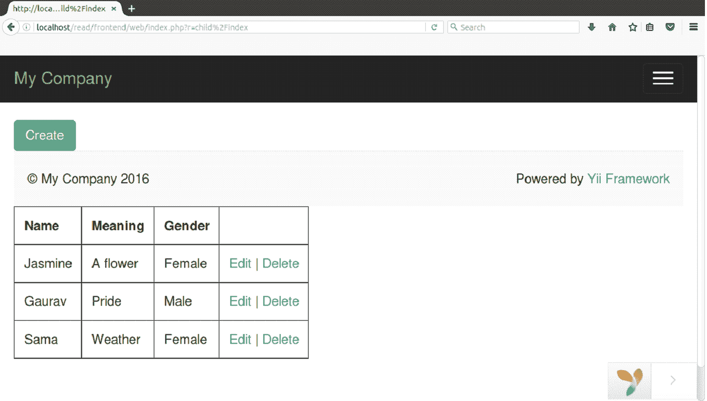

# 读取记录

> 原文：<https://www.javatpoint.com/yii-read-record>

现在我们将从我们的子表中获取数据。这里我们的 Yiii2 文件夹被命名为 **read。**

**步骤 1 创建模型文件**

在**前端/模型**文件夹中创建模型文件**child.php**。

```php
<?php 
namespace app\models; 

use Yii; 

class Child extends \yii\db\ActiveRecord 
{ 
    /** 
     * @inheritdoc 
     */ 
    public static function tableName() 
    { 
        return 'child'; 
    } 

    /** 
     * @inheritdoc 
     */ 
    public function rules() 
    { 
        return [ 
            [['name', 'meaning', 'gender'], 'required'], 
            [['name', 'meaning'], 'string', 'max' => 100], 
            [['gender'], 'string', 'max' => 15] 
        ]; 
    } 
}

```

**第 2 步添加动作阅读**

在 ChildController.php 文件中，我们需要添加动作**动作索引**来从表中获取数据。

```php

<?php 
namespace frontend\controllers; 

use Yii; 
use app\models\Child; 
use yii\web\Controller; 

/** 
 * manual CRUD 
 **/ 
class ChildController extends Controller 
{  
    /** 
     * Create 
     */ 
    public function actionCreate() 
    { 

        $model = new Child(); 

        // new record 
        if($model->load(Yii::$app->request->post()) && $model->save()){ 
            return $this->redirect(['index']); 
        } 

        return $this->render('create', ['model' => $model]); 
    } 

    /** 
     * Read 
     */ 
    public function actionIndex() 
    { 
        $child = Child::find()->all(); 

        return $this->render('index', ['model' => $child]); 
    }
    }

```

看看上面的代码，所有代码都是一样的，只是取数据的动作是在最后添加的。

**步骤 3 创建视图文件**

在**前端/视图/子**文件夹中，创建一个文件**index.php。**

```php
<?php 
use yii\helpers\Html; 
?> 

<style> 
table th,td{ 
    padding: 10px; 
} 
</style> 

<?= Html::a('Create', ['child/create'], ['class' => 'btn btn-success']); ?> 

<table border="1"> 
   <tr> 
        <th>Name</th> 
        <th>Meaning</th> 
        <th>Gender</th> 
    </tr> 
    <?php foreach($model as $field){ ?> 
    <tr> 
        <td><?= $field->name; ?></td> 
        <td><?= $field->meaning; ?></td> 
        <td><?= $field->gender; ?></td> 
        <td><?= Html::a("Edit", ['child/edit', 'id' => $field->id]); ?> | <?= Html::a("Delete", ['child/delete', 'id' => $field->id]); ?></td> 
    </tr> 
    <?php } ?>

```

**第四步运行**

在浏览器上运行它。

**http://localhost/read/frontend/web/index . PHP？r =子%2Findex**

[download this example](https://static.javatpoint.com/yii/src/read.zip)