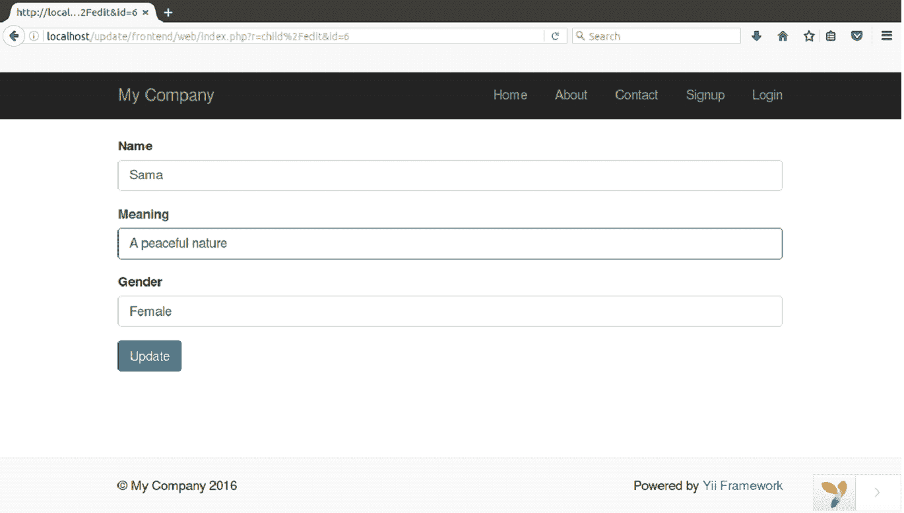
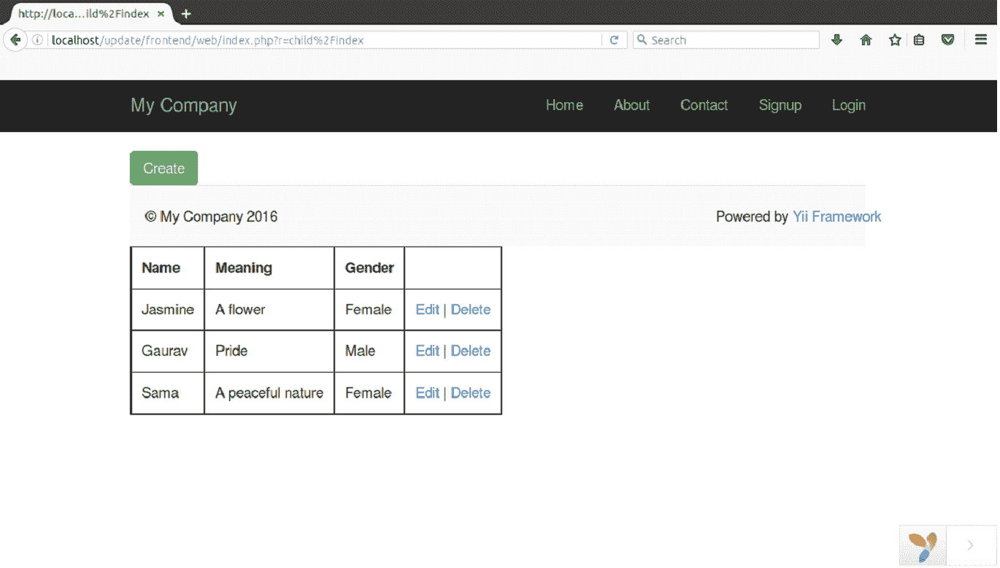

# 更新记录

> 原文：<https://www.javatpoint.com/yii-update-record>

要更新数据库中的记录，请执行以下步骤。我们已经将我们的 Yii2 文件夹命名为**更新。**

**步骤 1 创建模型文件**

在**前端/模型**文件夹中创建模型文件**child.php**。

```php
<?php 
namespace app\models; 

use Yii; 

class Child extends \yii\db\ActiveRecord 
{ 
    /** 
     * @inheritdoc 
     */ 
    public static function tableName() 
    { 
        return 'child'; 
    } 

    /** 
     * @inheritdoc 
     */ 
    public function rules() 
    { 
        return [ 
            [['name', 'meaning', 'gender'], 'required'], 
            [['name', 'meaning'], 'string', 'max' => 100], 
            [['gender'], 'string', 'max' => 15] 
        ]; 
    } 
}

```

**步骤 2 在控制器中添加动作**

在控制器文件**ChildController.php 中添加更新动作**动作编辑**。**

```php

<?php 
namespace frontend\controllers; 

use Yii; 
use app\models\Child; 
use yii\web\Controller; 

/** 
* manual CRUD 
 **/ 
class ChildController extends Controller 
{  
    /** 
     * Create 
     */ 
    public function actionCreate() 
    { 

        $model = new Child(); 

        // new record 
        if($model->load(Yii::$app->request->post()) && $model->save()){ 
            return $this->redirect(['index']); 
        } 

        return $this->render('create', ['model' => $model]); 
    } 

    /** 
     * Read 
     */ 
    public function actionIndex() 
    { 
        $child = Child::find()->all(); 

        return $this->render('index', ['model' => $child]); 
    } 

    /** 
     * Edit 
     * @param integer $id 
     */ 
    public function actionEdit($id) 
    { 
        $model = Child::find()->where(['id' => $id])->one(); 

        // $id not found in database 
        if($model === null) 
            throw new NotFoundHttpException('The requested page does not exist.'); 

        // update record 
        if($model->load(Yii::$app->request->post()) && $model->save()){ 
            return $this->redirect(['index']); 
        } 

        return $this->render('edit', ['model' => $model]); 
    } 
    }

```

**步骤 3 创建视图文件**

在**前端/视图/子**文件夹中创建文件**edit.php**。

```php
<?= $this->render('child_view', [ 
    'model' => $model, 
]) ?>

```

**第四步运行**

在浏览器上运行它。

**http://localhost/dbb/frontend/web/index . PHP？r =子% 2 编辑& id=6**



点击更新，信息将被更新。



看上面快照的最后一行，数据更新了。

[download this example](https://static.javatpoint.com/yii/src/update.zip)