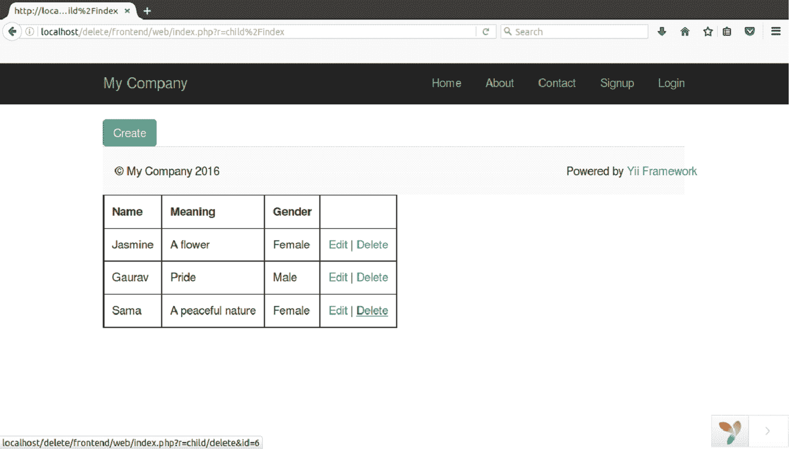
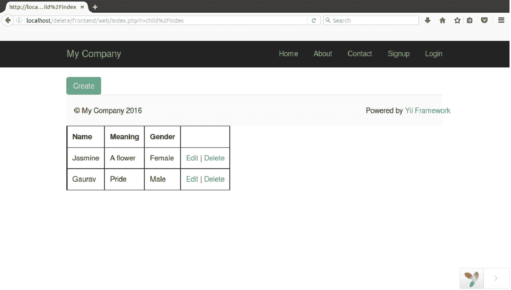

# 删除记录

> 原文：<https://www.javatpoint.com/yii-delete-record>

要删除数据库中的记录，请执行以下步骤。我们已经将我们的 Yii2 文件夹命名为 **delete。**

**步骤 1 创建模型文件**

在**前端/模型**文件夹中创建模型文件**child.php**。

```php
<?php 
namespace app\models; 

use Yii; 

class Child extends \yii\db\ActiveRecord 
{ 
    /** 
     * @inheritdoc 
     */ 
    public static function tableName() 
    { 
        return 'child'; 
    } 

    /** 
     * @inheritdoc 
     */ 
    public function rules() 
    { 
        return [ 
            [['name', 'meaning', 'gender'], 'required'], 
            [['name', 'meaning'], 'string', 'max' => 100], 
            [['gender'], 'string', 'max' => 15] 
        ]; 
    } 
}

```

**步骤 2 在控制器中创建动作**

创建一个动作**动作删除**ChildController.php**文件中的**。

```php

<?php 
namespace frontend\controllers; 

use Yii; 
use app\models\Child; 
use yii\web\Controller; 

/** 
 * manual CRUD 
 **/ 
class ChildController extends Controller 
{  
    /** 
     * Create 
     */ 
    public function actionCreate() 
    { 

        $model = new Child(); 

        // new record 
        if($model->load(Yii::$app->request->post()) && $model->save()){ 
            return $this->redirect(['index']); 
        } 

        return $this->render('create', ['model' => $model]); 
    } 

    /** 
     * Read 
     */ 
    public function actionIndex() 
    { 
        $child = Child::find()->all(); 

        return $this->render('index', ['model' => $child]); 
    } 

    /** 
     * Edit 
     * @param integer $id 
     */ 
    public function actionEdit($id) 
    { 
        $model = Child::find()->where(['id' => $id])->one(); 

        // $id not found in database 
        if($model === null) 
            throw new NotFoundHttpException('The requested page does not exist.'); 

        // update record 
        if($model->load(Yii::$app->request->post()) && $model->save()){ 
            return $this->redirect(['index']); 
        } 

        return $this->render('edit', ['model' => $model]); 
    } 

     /** 
    * Delete 
     * @param integer $id 
     */ 
     public function actionDelete($id) 
     { 
         $model = Child::findOne($id); 

        // $id not found in database 
        if($model === null) 
            throw new NotFoundHttpException('The requested page does not exist.'); 

        // delete record 
        $model->delete(); 

        return $this->redirect(['index']); 
     }    
   }

```

**第三步运行**

在浏览器上运行它。

**http://localhost/delete/frontend/web/index . PHP？r =子%2Findex**



查看上面的快照，单击表格最后一行中的删除选项。

看上面的快照，相应的行被从表中删除。

[download this example](https://static.javatpoint.com/yii/src/delete.zip)