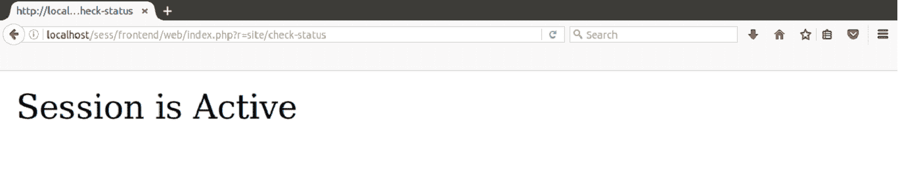

# 会议

> 原文：<https://www.javatpoint.com/yii-session>

会话允许我们为每个用户请求访问不同页面上的数据。按会话在服务器上的临时目录中创建一个文件来存储所有会话变量。在特定用户访问期间，该存储的数据可用于网站的所有页面。

在 PHP 中，session 是通过$_SESSION 全局变量访问的。

当会话开始时，

*   将为该特定会话生成唯一的标识。
*   一个 cookie 被发送到客户端。
*   所有这些会话变量都保存在服务器上的临时文件夹中。
*   当从会话变量中检索到一个值时，它会自动从 cookie 中获取唯一的会话标识。然后它会在临时文件夹中查找特定的文件。

* * *

## 会议开幕和闭幕

让我们看一个开始和结束会话的例子。

**第一步**转到**SiteController.php**档。添加动作**动作检查状态。**

```php
 public function actionCheckStatus() 
    { 
   $session = Yii::$app->session; 
   // open a session 
   $session->open(); 
   // check if a session is already active 
   if ($session->isActive) echo "Session is Active"; 
   // close a session 
   $session->close(); 
   // destroys all data registered to a session 
   $session->destroy(); 
    }

```

看看上面的代码，它显示会话打开，会话关闭，检查会话是否活动并销毁会话。

**第二步**用网址在浏览器上运行，

**http://localhost/sess/frontend/web/index . PHP？r =现场/检查状态**



* * *

## 访问会话数据

在访问数据期间，如果没有会话正在运行，会话将自动启动。

要访问会话中存储的数据，请运行以下代码。

```php
$session = Yii::$app->session;

// get a session variable. The following usages are equivalent:
$language = $session->get('language');
$language = $session['language'];
$language = isset($_SESSION['language']) ? $_SESSION['language'] : null;

// set a session variable. The following usages are equivalent:
$session->set('language', 'en-US');
$session['language'] = 'en-US';
$_SESSION['language'] = 'en-US';

// remove a session variable. The following usages are equivalent:
$session->remove('language');
unset($session['language']);
unset($_SESSION['language']);

// check if a session variable exists. The following usages are equivalent:
if ($session->has('language')) ...
if (isset($session['language'])) ...
if (isset($_SESSION['language'])) ...

// traverse all session variables. The following usages are equivalent:
foreach ($session as $name => $value) ...
foreach ($_SESSION as $name => $value) ...

```