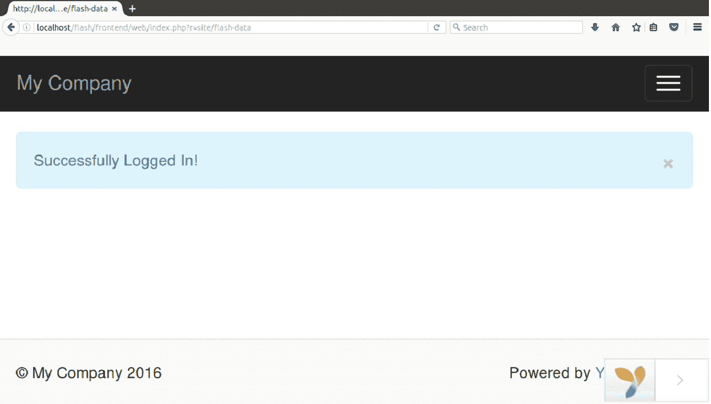

# 闪存数据

> 原文:[https://www.javatpoint.com/yii-flash-data](https://www.javatpoint.com/yii-flash-data)

闪存数据是一种会话数据，具有以下特点。

*   在一个请求中设置。
*   仅在下次请求时可用。
*   事后自动删除。

主要用于向终端用户传递只传递一次的消息，如登录后发送的确认消息。

### 例子

**步骤 1** 在**SiteController.php**文件中创建一个动作**闪存数据**。

```php
 public function actionFlashData() 
    { 
   $session = Yii::$app->session; 
   // set a flash message named as "welcome" 
   $session->setFlash('welcome', 'Successfully Logged In!'); 
   return $this->render('flashdata'); 
    } 

```

**步骤 2** 在**视图/站点**文件夹中创建视图文件**flashdata.php**。

```php
<?php 
   use yii\bootstrap\Alert; 
   echo Alert::widget([ 
      'options' => ['class' => 'alert-info'], 
      'body' => Yii::$app->session->getFlash('welcome'), 
   ]); 
?>

```

**第三步**用网址在浏览器上运行，

```php

http://localhost/flash/frontend/web/index.php?r=site/flash-data

```

