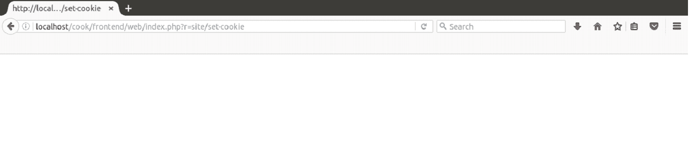
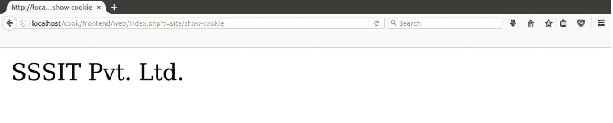

# 饼干

> 哎哎哎:# t0]https://www . javatppoint . com/yii cookie

cookie 是服务器嵌入到用户系统中的一个小文件，用于识别用户。

在 Yii 中，每个 cookie 都是 **yii\web\Cookie 的一个对象。**

**yii\web\Request** (请求中提交的 cookie 集合)和 **yii\web\Response** (需要发送给用户的 cookie 集合)通过名为 cookies 的属性维护 cookie 集合。

控制器处理应用程序中的 cookies 请求和响应。因此，应该在控制器中读取和发送 cookies。

* * *

## 设置饼干

使用以下代码向最终用户发送 cookies。

```php
// get the cookie collection (yii\web\CookieCollection) from the "response" component
$cookies = Yii::$app->response->cookies;

// add a new cookie to the response to be sent
$cookies->add(new \yii\web\Cookie([
    'name' => 'name',
    'value' => 'sssit',
]));

```

* * *

## 获取饼干

要获取 cookie，请使用以下代码。

```php
// get the cookie collection (yii\web\CookieCollection) from the "request" component
$cookies = Yii::$app->request->cookies;

// get the cookie value. If the cookie does not exist, return "default" as the default value.
$name = $cookies->getValue('name', 'default');

// an alternative way of getting the "name" cookie value
if (($cookie = $cookies->get('name')) !== null) {
    $name = $cookie->value;
}

// you may also use $cookies like an array
if (isset($cookies['name'])) {
    $name = $cookies['name']->value;
}

// check if there is a "name" cookie
if ($cookies->has('name')) ...
if (isset($cookies['name'])) ...

```

* * *

## 正在删除 Cookies

要移除饼干，使用 Yii 的**移除()**功能。

```php
$cookies = Yii::$app->response->cookies;
// remove a cookie
$cookies->remove('name');
// equivalent to the following
unset($cookies['name']);

```

**示例:**

让我们看一个例子来设置和显示 cookie 的值。

**步骤 1** 在**SiteController.php**文件中添加两个动作**动作设置 Cookie** 和**动作显示 Cookie** 。

```php
class SiteController extends Controller 
{ 
    /** 
     * @inheritdoc 
     */ 
    public function behaviors() 
    { 
        return [ 
            'access' => [ 
                'class' => AccessControl::className(), 
                'only' => ['logout', 'signup'], 
                'rules' => [ 
                    [ 
                        'actions' => ['signup'], 
                        'allow' => true, 
                        'roles' => ['?'], 
                    ], 
                    [ 
                        'actions' => ['logout', 'set-cookie', 'show-cookie'], 
                        'allow' => true, 
                        'roles' => ['@'], 
                    ], 
                ], 
            ], 
            'verbs' => [ 
                'class' => VerbFilter::className(), 
                'actions' => [ 
                    'logout' => ['post'], 
                ], 
            ], 
        ]; 
    } 

    /** 
     * @inheritdoc 
     */ 
    public function actions() 
   { 
        return [ 
            'error' => [ 
                'class' => 'yii\web\ErrorAction', 
            ], 
            'captcha' => [ 
                'class' => 'yii\captcha\CaptchaAction', 
                'fixedVerifyCode' => YII_ENV_TEST ? 'testme' : null, 
            ], 
        ]; 
    } 

    public function actionSetCookie() 
    { 
        $cookies = Yii::$app->response->cookies; 
        $cookies->add(new \yii\web\Cookie 
            ([ 
            'name' => 'test', 
            'value' => 'SSSIT Pvt. Ltd.' 
            ])); 
    } 

    public function actionShowCookie() 
    { 
        if(Yii::$app->getRequest()->getCookies()->has('test')) 
        { 
            print_r(Yii::$app->getRequest()->getCookies()->getValue('test')); 
        } 
    } 

```

**第二步**在浏览器上运行，先用以下网址设置 cookie，

**http://localhost/cook/frontend/web/index . PHP？r =站点/设置 cookie**



**第三步**在浏览器上运行，显示如下网址的 cookie，

**http://localhost/cook/frontend/web/index . PHP？r =站点/展示-cookie**

