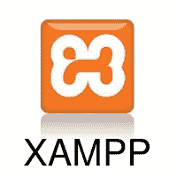

# XAMPP 教程

> 原文:[https://www.javatpoint.com/xampp](https://www.javatpoint.com/xampp)

XAMPP 是广泛使用的跨平台 web 服务器之一，它帮助开发人员在本地 web 服务器上创建和测试他们的程序。它是由 **Apache Friends** 开发的，它的原生源代码可以被观众修改或修改。它由 **Apache HTTP 服务器、MariaDB 和解释器**组成，用于不同的编程语言，如 PHP 和 Perl。它有 11 种语言版本，不同平台都支持，比如 Windows 的 IA-32 包&macOS 和 Linux 的 x64 包。

## 什么是 XAMPP？

XAMPP 是一个缩写，其中 ***X 代表跨平台，A 代表 Apache，M 代表 [MYSQL](https://www.javatpoint.com/mysql-tutorial) ，Ps 分别代表 PHP 和 Perl*T5。这是一个开源的网络解决方案包，包括许多服务器的 Apache 发行版和命令行可执行程序，以及 Apache 服务器、 [MariaDB](https://www.javatpoint.com/mariadb-tutorial) 、PHP 和 Perl 等模块。**

XAMPP 帮助本地主机或服务器通过电脑和笔记本电脑测试其网站和客户端，然后将其发布到主服务器。它是一个平台，通过主机本身的系统，提供一个合适的环境来测试和验证基于 Apache、Perl、MySQL 数据库和 PHP 的项目的工作。在这些技术中， [Perl](https://www.javatpoint.com/perl-tutorial) 是一种用于 web 开发的编程语言， [PHP](https://www.javatpoint.com/php-tutorial) 是一种后端脚本语言，而 MariaDB 是 MySQL 开发的使用最生动的数据库。这些组件的详细描述如下。

## XAMPP 的组成部分

如前所述，XAMPP 被用来象征不同技术解决方案的分类。它为通过个人服务器测试基于不同技术的项目提供了基础。XAMPP 是每个字母的缩写形式，代表它的每个主要组成部分。这个软件集合包含一个名为 **Apache** 的网络服务器，一个名为 **MariaDB** 的数据库管理系统，以及脚本/编程语言，如 **PHP** 和 **Perl** 。x 表示跨平台，表示可以在 [Windows](https://www.javatpoint.com/windows) 、 [Linux](https://www.javatpoint.com/linux-tutorial) 、macOS 等不同平台上工作。

许多其他组件也是这个软件集合的一部分，并在下面解释。

1.  **跨平台:**不同的本地系统安装的操作系统配置不同。跨平台的组件已经包括在内，以增加这个 Apache 发行包的实用性和受众。它支持各种平台，如视窗、莱纳斯和苹果操作系统的软件包。
2.  **Apache:** 它是一个 HTTP 一个跨平台的 web 服务器。它在世界范围内被用于传递网络内容。在 Apache 软件基金会的支持下，服务器应用程序已经免费安装并供开发人员社区使用。Apache 的远程服务器将请求的文件、图像和其他文档传递给用户。
3.  **马里亚数据库:**最初，MySQL DBMS 是 XAMPP 的一部分，但现在已经被马里亚数据库取代。它是最广泛使用的关系型数据库管理系统之一，由 MySQL 开发。它提供数据存储、操作、检索、整理和删除的在线服务。
4.  **PHP:** 它是主要用于 web 开发的后端脚本语言。PHP 允许用户创建动态网站和应用程序。它可以安装在每个平台上，并支持各种数据库管理系统。它是用 C 语言实现的。PHP 代表**超文本处理器**。据说它源自个人主页工具，这解释了它的简单性和功能性。
5.  **Perl:** 它是两种高级动态语言的组合，即 Perl 5 和 Perl 6。Perl 可以应用于寻找基于系统管理、web 开发和网络的问题解决方案。Perl 允许用户编写动态 web 应用程序。它非常灵活和健壮。
6.  **phpMyAdmin:** 是用来处理 MariaDB 的工具。其 4.0.4 版本目前正在 XAMPP 使用。数据库管理系统的管理是它的主要作用。
7.  **OpenSSL:** 它是安全套接字层协议和传输层协议的开源实现。目前 0.9.8 版本是 XAMPP 的一部分。
8.  **XAMPP 控制面板:**这是一个帮助操作和管理 XAMPP 其他部件的面板。版本 3.2.1 是最新的更新。控制面板的详细描述将在本教程的下一部分中完成。
9.  **Webalizer:** 这是一个 Web Analytics 软件解决方案，用于用户日志并提供有关使用的详细信息。
10.  **水星:**是邮件传输系统，最新版本是 4.62。它是一个邮件服务器，帮助管理网络上的邮件。
11.  **雄猫:**7 . 0 . 42 版本目前正在 XAMPP 使用。它是一个基于 JAVA 的 servlet，提供 JAVA 功能。
12.  **Filezilla:** 它是一个文件传输协议服务器，支持并简化对文件执行的传输操作。它最近更新的版本是 0.9.41。

## XAMPP 格式支持

XAMPP 支持三种文件格式:

*   **。EXE** -它是一个扩展名，用于表示可执行文件，使其可访问安装，因为可执行文件可以作为任何普通程序在计算机上运行。
*   **.7z - 7zip 文件** -此扩展名用于表示支持多种数据压缩和加密算法的压缩文件。它更受形式主义者的青睐，尽管它需要处理更复杂的文件。
*   **。ZIP** -该扩展支持文件无损压缩。一个压缩文件可能包含多个压缩文件。 **Deflate 算法**主要用于该格式支持的文件压缩。那个。与相比，ZIP 文件的安装相当棘手。可执行程序的扩展名

因此。EXE 是最直接的安装格式，而其他两种格式安装起来相当复杂。

## 先决条件

在深入学习 XAMPP 教程之前，你必须对网页开发语言有一个基本的了解，比如 [HTML](https://www.javatpoint.com/html-tutorial) ，和 PHP。

## 观众

我们的 XAMPP 教程是为希望在本地主机网络服务器上测试其网站或应用程序的有志之士设计的。本教程将帮助那些想成为前端或网络开发人员的人。

## 问题

我们向您保证，它将解决您所有与 XAMPP 相关的疑问，您在本教程中不会发现任何问题。尽管如此，如果有任何错误或差异，请在联系表中公布问题。

* * *