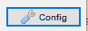
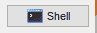
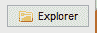
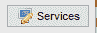
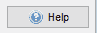
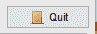
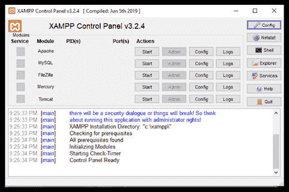
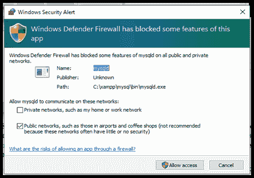
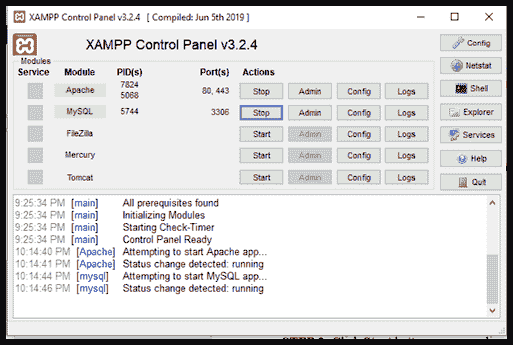

# XAMPP 控制面板

> 原文：<https://www.javatpoint.com/xampp-control-panel>

本文定义了术语“XAMPP 控制面板”及其用途。

**XAMPP 控制面板**是一个管理工具，用于监督 XAMPP 单个组件的动作。它控制文本服务器的每个组件。用户可以通过操作“操作”栏下的按钮来启动或停止离散模块。控制面板高效管理 [XAMPP](https://www.javatpoint.com/xampp) 套装的所有组件。

人们可以使用控制面板来确定 Apache、MySQL、Mercury 等。当前是否在运行。开发环境只有在 Apache 和 [MySQL](https://www.javatpoint.com/mysql-tutorial) 处于运行状态时才能使用。XAMPP 控制面板图标位于系统托盘中。它是一个橙色图标，当面板处于运行状态时可见。如果看不到，请按照以下步骤启动控制面板:

转到所有程序→阿帕奇朋友→ XAMPP → XAMPP 控制面板。如果它已经处于运行状态，您将收到一个错误！留言。

## 控制面板的功能

XAMPP 控制面板提供了几个按钮，如配置、帮助、网络状态、退出、外壳、浏览器和服务。每个按钮及其功能定义如下

此按钮用于将 XAMPP 配置为一个整体，以及其离散组件。

此按钮可让您显示系统上当前活动的所有进程。

该按钮允许打开 UNIX 外壳。

此按钮用于在 Windows 资源管理器中打开 XAMPP 文件夹。

此按钮有助于显示后端当前活动的所有服务。

该按钮通过提供用户论坛的链接来帮助用户。

顾名思义，该按钮用于离开 XAMPP 控制面板。

## 操作 XAMPP 控制面板

本文的这一部分涉及操作控制面板来管理 MySQL 和 Apache 的启动和停止操作的步骤。

**步骤 1-** 点击显示的图标打开 XAMPP 控制面板

如果图标不可见，请转到:

**所有程序→阿帕奇好友→ XAMPP → XAMPP 控制面板。**

**STEP 2-** 点击**阿帕奇**和 **MySQL** 对应的**启动**按钮。强烈建议不要选中最左端的服务复选框，因为将这些模块作为服务运行可能会导致与共享标准端口的其他应用程序或服务器发生冲突。当不包括运行相当长时间的 Apache 和 MySQL 组件时，以物理方式建立和终止服务被认为更好。

**步骤 3-** 最初，在启动 Apache 或 MySQL 时， [Windows](https://www.javatpoint.com/windows) 安全将询问您是否允许访问本地网络上的服务器，以便解除对服务器的阻止并授予对系统的访问权限。

**步骤 4-****“动作”**按钮是在开始/停止之间切换的切换按钮。一旦模块处于活动状态，端口信息也是可用的。

**步骤 5-** 点击右上角的关闭×按钮，XAMPP 可以在后台运行。现在可以通过通知区域访问它。

**STEP 6** -要在后台运行时管理 XAMPP 控制面板，只需右键点击**通知区**中的 **XAMPP 图标**，无需打开即可启动/停止组件。

**步骤 7-模块 **-** 的管理**和**配置**按钮

**Admin** :在 Apache 的情况下，在默认浏览器中为 Windows Admin 页面打开 XAMPP，对于 MySQL，在默认浏览器中重定向到 PHPMyAdmin。

**Config** :在 apache 的情况下，它提供对 Apache 文件夹和配置文件的访问，比如 httpd.conf，对于 MySQL，它授予对 MySQL 数据库文件夹的访问权限。

**步骤 8-** 要暂停任何组件的运行，如 Apache 或 MySQL，点击与您希望停止的模块对应的**“停止”**按钮。

**STEP 9-** 要停止控制面板作为后台应用运行，点击右下角**“退出”**按钮。这将从通知栏中删除 XAMPP 启动器。要再次运行，需要重新启动 XAMPP 控制面板。

* * *