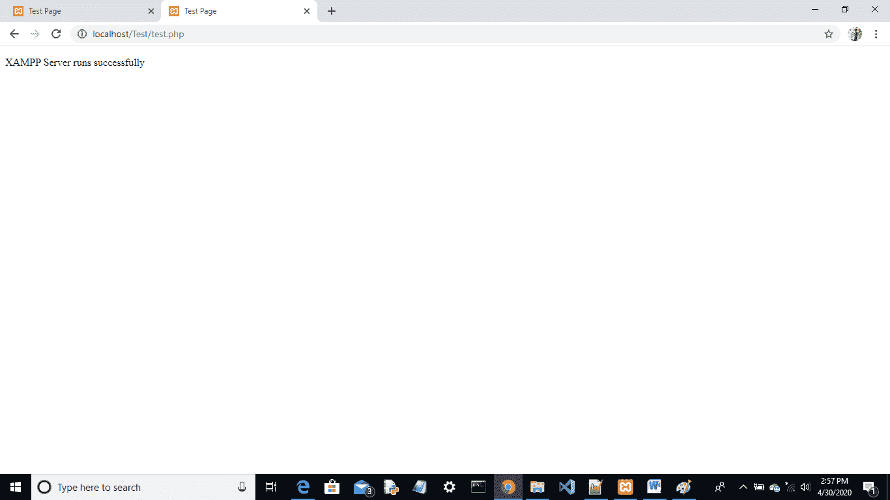

# 测试 XAMPP 安装

> 原文:[https://www.javatpoint.com/testing-xampp-installation](https://www.javatpoint.com/testing-xampp-installation)

Xampp 允许我们在本地服务器上工作，并使用 PHP 代码和 mysql 数据库测试网站的本地副本。如果 xampp 处于活动状态，则可以使用 URL 在浏览器上访问任何本地副本。XAMPP 是一个跨平台的软件，因此它可以在任何操作系统上使用。

### XAMPP 控制面板:

[XAMPP 控制面板](https://www.javatpoint.com/xampp-control-panel)为我们提供了对所有 XAMPP 组件的完全控制。该面板可用于启动和停止各种模块。xampp 控制面板上提供的模块有:-

*   街头流氓
*   关系型数据库
*   档案 Zilla
*   汞
*   雄猫

### 测试 XAMPP 安装:

在控制面板中，单击 Apache 模块的启动操作。这将指示 XAMPP 启动阿帕奇网络服务器。现在打开任何网络浏览器并键入:http://localhost 或 127.0.0.1，您应该会看到 XAMPP 屏幕。这意味着您的系统上已经正确安装了 XAMPP。

按照这些步骤检查 [XAMPP](https://www.javatpoint.com/xampp) 服务器配置是否正确，我们可以创建一个 [PHP](https://www.javatpoint.com/php-tutorial) 测试页面。该页面可以存储在 XAMPP 的本地主机下，并且可以在浏览器上运行。

**创建 PHP 页面的步骤:-**

1.  打开 c 盘中的 XAMPP 目录，选择 htdocs 文件夹(C:\xampp\htdocs 用于标准安装)。该目录包含运行网页所需的所有数据。
2.  请为 htdocs 中的测试页面创建一个新的文件夹 **Test** 。
3.  打开记事本，键入以下代码，并将文件保存在测试文件夹中。
4.  请确保您已经使用保存了该文件。php 扩展。

```php
        <!doctype html>
        <html>
              <head>
                   <title> Test Page</title>
              </head>
              <body>
                   <p> XAMPP Server runs successfully</p>
              </body>
        </html>

```

6.  打开 XAMPP 控制面板并启动 apache 模块。
7.  打开浏览器，在“网址”选项卡中键入 localhost/Test/test.php。如果您的浏览器显示“XAMPP 服务器运行成功”，则表示 XAMPP 已成功安装并正确配置。

**本地主机的输出:**



从输出屏幕可以看到，XAMPP 服务器安装成功，你也成功编写了自己的第一个 [PHP 程序](https://www.javatpoint.com/php-programs)。现在，您可以使用它来创建和测试您的 PHP 网络应用程序，甚至学习网络服务器如何与 OpenSSL、Tomcat 和其他工具一起工作。我们只启动了 apache 模块进行测试，但是你也可以启动其他模块，比如 [MySQL](https://www.javatpoint.com/mysql-tutorial) 、FileZila、Mercury、Tomcat 来创建网络应用。

* * *