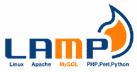

# XAMPP vs WAMP vs MAMP vs LAMP

> 原文:[https://www.javatpoint.com/xampp-vs-wamp-vs-mamp-vs-lamp](https://www.javatpoint.com/xampp-vs-wamp-vs-mamp-vs-lamp)

XAMPP 可以被描述为用于跨多个平台提供 web 解决方案的软件捆绑包。它通过提供一个环境来开发和测试基于 Apache 服务器、数据库管理系统(如 MariaDB)和脚本语言(如 Perl 和 PHP)的项目，从而为本地开发人员提供帮助。像 XAMPP 一样，也有许多类似的开源本地服务器提供类似的帮助和功能。在本文中，我们将研究 MAMP、WAMP 和 LAMP，以分析和比较这四个国家。

## XAMPP(洗发精)

[XAMPP](https://www.javatpoint.com/xampp) 是首字母缩略词，其中“X”代表 Multiplatform，“A”代表 Apache 服务器，“M”代表 [MariaDB](https://www.javatpoint.com/mariadb-tutorial) ，“P”代表 [Perl](https://www.javatpoint.com/perl-tutorial) ，“P”代表 [PHP](https://www.javatpoint.com/php-tutorial) 。它是一个软件堆栈，包括在互联网上部署之前用于在本地开发和测试[网站](https://www.javatpoint.com/website)的 Apache 发行版。它是多平台的，并且受到许多操作系统的支持，如 [Windows](https://www.javatpoint.com/windows) 、MacOS、 [Linux](https://www.javatpoint.com/linux-tutorial) 。许多文件格式支持它，这增加了它的健壮性。它易于安装和使用。控制面板便于管理和实施。

## 服务器

WAMP 是另一个本地服务器，它是一个软件包，包括 Apache Server(代表 A)、MySQL 数据库(代表 M)和基于 PHP 脚本的语言(代表 P)。WAMP 的“W”表示其对视窗操作系统的排他性。在基于 Windows 的系统中，WAMP 被用来测试动态网站，而无需在网络服务器上发布。用 PHP 实现和开发很方便。它适用于 32 位和 64 位系统。

## 美国。

MAMP 是本地服务器，兼容(M) Mac 操作系统，支持基于(A) Apache Server、(M) MySQL 数据库和(P) [PHP OOPS](https://www.javatpoint.com/php-oops-concepts) 基础编程语言的 web 项目开发测试。只需点击几下鼠标，就可以轻松安装在基于苹果的系统上。主要用于 Mac OS，用 MAMP 的首字母 M 表示。它提供了在系统上运行 WordPress 所需的所有设备。

## 灯

这是一个首字母缩略词，其中“L”代表 Linux，“A”代表 Apache，“M”代表 [MySQL](https://www.javatpoint.com/mysql-tutorial) ，“P”代表各种编程语言，如 PHP、Perl 和 Python。它是一个仅由 Linux 操作系统支持的本地服务器，不能在任何其他操作系统上运行。这是一个轻量级软件包，由基于 Linux 的本地主机使用，用于在直播平台上启动网页之前测试它们。与其他类似的软件包不同，它支持多种编程语言的开发，如 PHP、Perl 和 [Python](https://www.javatpoint.com/python-tutorial) 。

## 比较与分析

| 基础 | XAMPP(洗发精) | 美国。 | 服务器 | 灯 |
| **支撑平台。** | 它是一个跨平台的软件包，由 Linux、Windows 和 Mac OS 等平台支持。 | 这个软件栈只适用于 MAC 操作系统。 | WAMP 本地服务器仅受 Windows 操作系统支持。 | LAMP 由单一平台支持，即基于 Linux 的系统。 |
| **编程语言** | 在 XAMPP，用于开发的编程/脚本语言是 Perl 和 PHP。 | 开发和测试的编码是在 MAMP 服务器中使用 PHP 完成的。 | WAMP 使用 PHP(一种基于脚本的编程语言)进行开发和测试。 | 与其他类似的本地服务器不同，LAMP 在开发方面是多语言的。它支持用 PHP、Perl 和 Python 进行编码。 |
| **数据库** | XAMPP 使用的是关系数据库管理系统 MariaDB。是 MySQL 开发的。 | MAMP 将其数据存储在关系数据库中。它使用 MySQL 进行数据存储和检索。 | 就像 MAMP 一样，WAMP 使用 MySQL，这是一种用于存储和检索数据的关系数据库管理系统。 | LAMP 使用 MySQL RDBMS 支持其数据存储功能和其他基于数据的操作。 |
| **服务器** | Apache Server 用于测试和运行本地主机的网页。 | 它使用 Apache 网络服务器。 | WAMP 使用阿帕奇网络服务器。 | LAMP 和其他本地服务器一样，使用 Apache Web 服务器。 |
| **安装过程** | 安装过程很简单，但不同的平台可能会有所不同 | 安装过程非常简单。只需要几下点击和几分钟。 | 易于下载和安装，并且重量轻。 | LAMP 便于安装和运行。 |

* * *