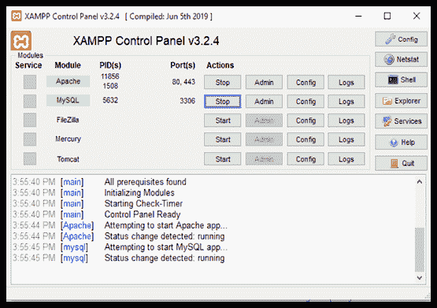
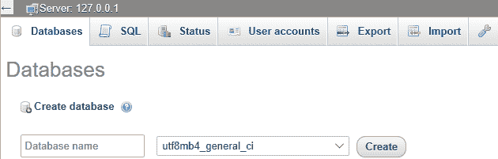
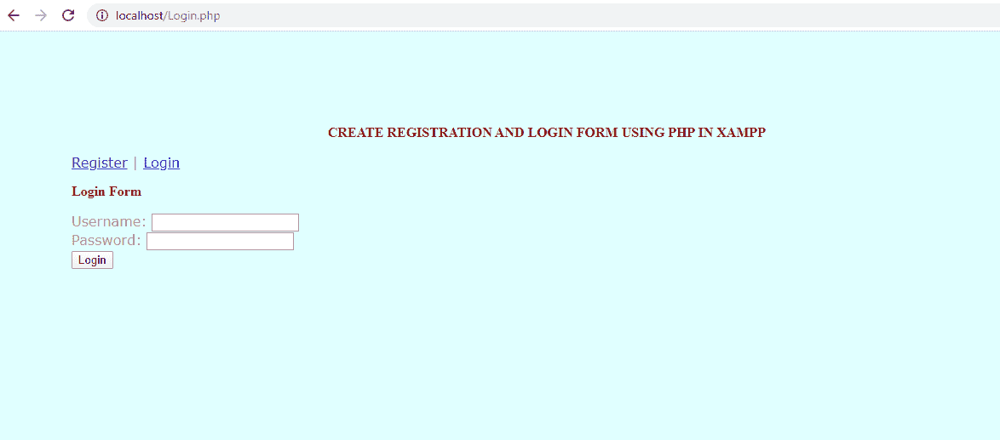
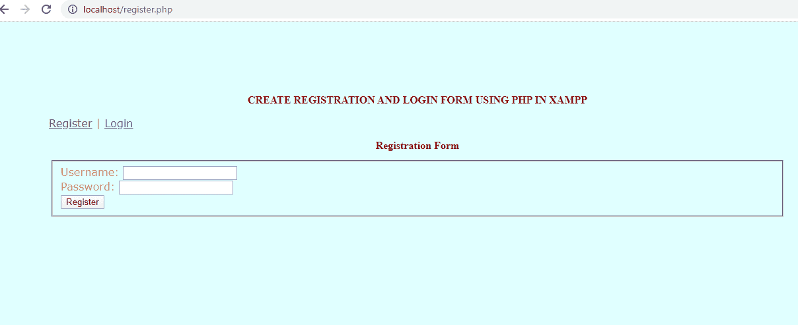
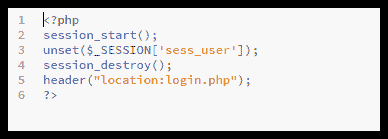

# 使用 XAMPP 创建登录页面

> 原文：<https://www.javatpoint.com/creating-login-page-using-xampp>

登录页面是最容易创建的，也是任何网站最基本的单元。构建登录系统的最好方法是使用 XAMPP 和一些文本文件。正如在前面的文章中所讨论的，XAMPP 是一个软件包，它为实现 web 解决方案并验证它提供了一个合适的环境。验证是在通过实时网络部署网站之前完成的。 [XAMPP](https://www.javatpoint.com/xampp) 包包含 [PHP](https://www.javatpoint.com/php-tutorial) ，在一个登录系统的开发中起着最关键的作用。开始创建网站登录页面之前的软件要求如下所述:

## 创建登录页面的先决条件

*   像 XAMPP 这样的本地主机软件——它是“跨平台”、“Apache”这种网络服务器、“MariaDB”这种关系型数据库管理系统、“PHP”和“Perl”脚本语言的简称。
*   对 HTML、PHP 和查询构造有足够的了解。
*   用于文本编辑和修改的软件，如括号、记事本、Dreamweaver 等。这里我们将使用括号。

## 登录页面的基本文件

在进入创建登录系统的步骤之前，我们需要创建一些强制文件，这些文件将在以后的登录页面开发过程中使用。本文还将讨论创建每个文件的过程。

1.  **html -** 强制创建此文件，因为它用于页面的“图形用户界面”视图和空字段验证。
2.  **css -** 包含这个文件很重要，因为它需要让页面看起来对用户有吸引力，并通过对登录页面进行有吸引力的格式化来吸引观众。
3.  **php -** 这个文件有着至关重要的作用，因为它包含了页面数据库连接的连接代码。
4.  **php -** 这个文件的作用是验证。它用于将用户提交的表单数据与数据库进行交叉检查。

## 创建登录页面的过程

下面给出了成功开发任何网站登录页面的步骤。

**步骤 1-** 首先，通过点击图标启动 [XAMPP 控制面板](https://www.javatpoint.com/xampp-control-panel)，点击**对应 **Apache** 和**T10】MySQLT12】模块的【启动】**按钮。**



**STEP 2-** 现在打开您系统上的任何网络浏览器，访问给定的地址- **http:// localhost 或 http://127.0.0.1** 。如果服务器运行成功，请继续下一步。

**STEP 3-** 重新启动 XAMPP 控制面板，点击 MySQL 模块对应的**【管理员】**。它会将您重定向到**本地主机/phpmyadmin/** 。现在，为登录页面的验证表单创建数据库。

**STEP 4-** 在数据库名称中按要求输入名称后，点击**【创建】**新建数据库。这里我们将其命名为**“登录页面”。**



**步骤 5-** 现在，点击 SQL 选项卡按钮。粘贴下面给出的查询，点击**“去**”该表已成功创建。


**步骤 6-** 继续将网页文件放入目标文件夹。文件夹可以按照以下顺序定位- **c:/xampp/htdocs。**

**STEP 7-** 启动**括号**(一个开源文本编辑器)并创建 login.php 文件。将下面提到的代码行复制粘贴到**login.php**文件中。

```php
<?php   
session_start();  
if(!isset($_SESSION["sess_user"])){  
    header("location:login.php");  
} else {  
?>  
<!doctype html>  
<html>  
<head>  
<title>Welcome</title>  
    <style>   
        body{  

    margin-top: 110px;  
    margin-bottom: 110px;  
    margin-right: 160px;  
    margin-left: 90px;  
    background-color: lightcyan;  
    color: palevioletred;  
    font-family: verdana;  
    font-size: 100%  

        }  
            h2 {  
    color: darkred;  
    font-family: indigo;  
    font-size: 100%;  
}  
        h1 {  
    color: darkred;  
    font-family: indigo;  
    font-size: 100%;  
}  

    </style>  
</head>  
<body>  
    <center><h1>CREATE REGISTRATION AND LOGIN FORM USING PHP IN XAMPP</h1></center>  

<h2>Welcome, <?=$_SESSION['sess_user'];?>! <a href="logout.php">Logout</a></h2>  
<p>  
WE DID IT. SUCCESSFULLY CREATED REGISTRATION AND LOGIN FORM USING PHP IN XAMPP  
</p>  
</body>  
</html>  
<?php  
}  
?>  

```



**步骤 8-** 现在，创建另一个名为**Register.php**的文件，并将下面提到的代码复制粘贴到数据中，并用未使用的用户名注册您的姓名和密码。

```php

<!doctype html>  
<html>  
<head>  
<title>Register</title>  
    <style>   
        body{  
    margin-top: 110px;  
    margin-bottom: 110px;  
    margin-right: 160px;  
    margin-left: 90px;  
    background-color: lightcyan;  
    color: palevioletred;  
    font-family: verdana;  
    font-size: 100%  

        }  
            h1 {  
    color: darkred;  
    font-family: indigo;  
    font-size: 100%;  
}  
         h2 {  
    color: darkred;  
    font-family: indigo;  
    font-size: 100%;  
}</style>  
</head>  
<body>  

    <center><h1>CREATE REGISTRATION AND LOGIN FORM USING PHP IN XAMPP</h1></center>  
   <p><a href="register.php">Register</a> | <a href="login.php">Login</a></p>  
    <center><h2>Registration Form</h2></center>  
<form action="" method="POST">  
    <legend>  
    <fieldset>  

Username: <input type="text" name="user"><br />  
Password: <input type="password" name="pass"><br />   
<input type="submit" value="Register" name="submit" />  

        </fieldset>  
        </legend>  
</form>  
<?php  
if(isset($_POST["submit"])){  
if(!empty($_POST['user']) && !empty($_POST['pass'])) {  
    $user=$_POST['user'];  
    $pass=$_POST['pass'];  
    $con=mysql_connect('localhost','root','') or die(mysql_error());  
    mysql_select_db('user_registration') or die("cannot select DB");  

    $query=mysql_query("SELECT * FROM login WHERE username='".$user."'");  
    $numrows=mysql_num_rows($query);  
    if($numrows==0)  
    {  
    $sql="INSERT INTO login(username,password) VALUES('$user','$pass')";  

    $result=mysql_query($sql);  
        if($result){  
    echo "Account Successfully Created";  
    } else {  
    echo "Failure!";  
    }  

    } else {  
    echo "That username already exists! Please try again with another.";  
    }  

} else {  
    echo "All fields are required!";  
}  
}  
?>  
</body>  
</html>

```



**STEP 9-** 第三个要创建的文件是**Logout.php。**本文件使用的代码如下。



**STEP 10-** 最后要创建的文件是**Member.php 文件**。该文件应包含以下代码。

```php
<?php   
session_start();  
if(!isset($_SESSION["sess_user"])){  
    header("location:login.php");  
} else {  
?>  
<!doctype html>  
<html>  
<head>  
<title>Welcome</title>  
    <style>   
        body{  

    margin-top: 110px;  
    margin-bottom: 110px;  
    margin-right: 160px;  
    margin-left: 90px;  
    background-color: lightcyan;  
    color: palevioletred;  
    font-family: verdana;  
    font-size: 100%  

        }  
            h2 {  
    color: darkred;  
    font-family: indigo;  
    font-size: 100%;  
}  
        h1 {  
    color: darkred;  
    font-family: indigo;  
    font-size: 100%;  
}  

    </style>  
</head>  
<body>  
    <center><h1>CREATE REGISTRATION AND LOGIN FORM USING PHP IN XAMPP</h1></center>  

<h2>Welcome, <?=$_SESSION['sess_user'];?>! <a href="logout.php">Logout</a></h2>  
<p>  
WE DID IT. SUCCESSFULLY CREATED REGISTRATION AND LOGIN FORM USING PHP IN XAMPP  
</p>  
</body>  
</html>  
<?php  
}  
?>

```

**STEP 11-** 最后一步是检查数据库，验证数据是否已经存储。

* * *