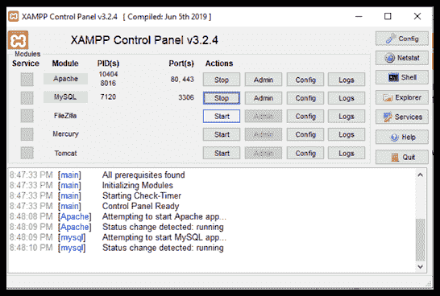
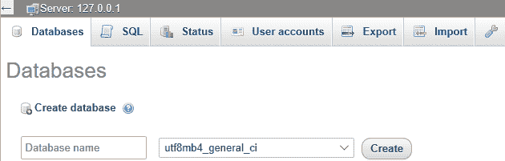
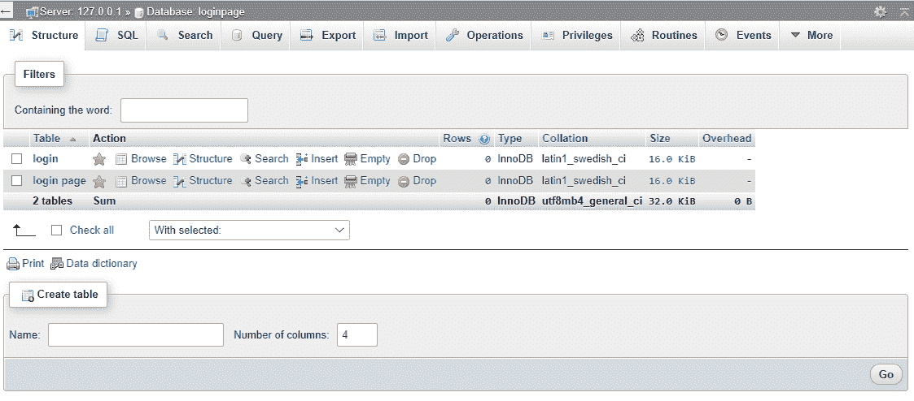
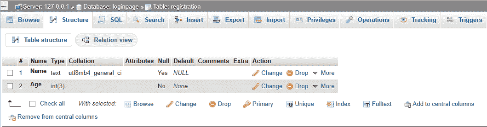
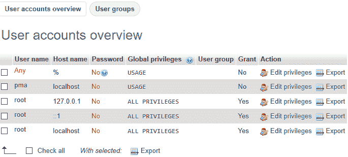
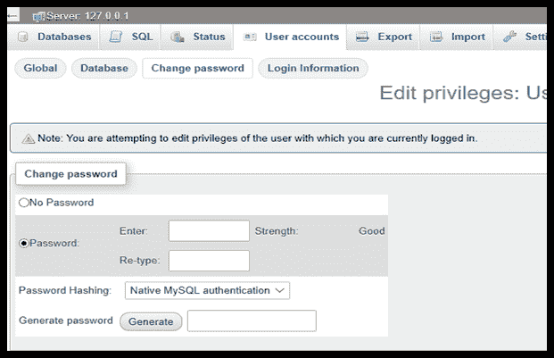

# 用 XAMPP 创建我的数据库

> 原文:[https://www . javatpoint . com/creating-MySQL-database-with-xampp](https://www.javatpoint.com/creating-mysql-database-with-xampp)

XAMPP 软件栈是一个开源的本地主机服务器，通过它包含的软件包提供许多功能。软件是 XAMPP 的一部分，使用 [XAMPP 控制面板](https://www.javatpoint.com/xampp-control-panel)启动/停止。它用于在全球网络上启动项目和修改之前，对项目和修改进行离线测试。XAMPP 提供的一个非常重要的功能是创建 MySQL 数据库。这是通过使用 **phpMyAdmin** 完成的。本文将详细解释什么是 phpMyAdmin，以及如何使用它与 [XAMPP](https://www.javatpoint.com/xampp) 一起创建 MySQL 数据库。

## phpMyAdmin

phpMyAdmin 是一款免费的开源软件，提供通过互联网操作和管理 [MySQL](https://www.javatpoint.com/mysql-tutorial) 的功能。借助一个名为 phpMyAdmin 的图形用户界面，它为用户控制和管理数据库提供了便利。这个图形用户界面是用 [PHP](https://blog.templatetoaster.com/code-first-php-web-page/) 编程语言编写的。随着时间的推移，为了找到一个基于网络的 MySQL 管理解决方案，它获得了很多信任和需求。用户可以通过 phpMyAdmin 用户界面操作 MySQL，同时仍然可以直接执行 [SQL](https://www.javatpoint.com/sql-tutorial) 查询。[图形用户界面](https://www.javatpoint.com/gui-full-form)允许主机对数据库进行多种操作，如编辑、创建、删除、修改、更改字段、表格、索引等。它还可以通过授予特权和权限来管理对数据的访问控制。因此，phpMyAdmin 在处理和创建数据库方面起着至关重要的作用。

## 使用 XAMPP 创建 MySQL 数据库的步骤

**步骤 1-** 在您的系统中导航到 XAMPP，或者单击 XAMPP 图标启动它。控制面板现在可见，可用于启动或停止任何模块的工作。

**STEP 2-** 点击 **Apache** 和 **MySQL** 模块对应的**“开始”**按钮。一旦它开始工作，用户可以看到以下屏幕:

**STEP 3-** 现在点击 **MySQL** 模块对应的**【管理员】**按钮。这会自动将用户重定向到以下地址的网络浏览器

http://localhost/phpmyadmin

**步骤 4-** 可以看到数据库、SQL、用户账户、导出、导入、设置等多个选项卡。点击**“数据库”**选项卡。在这里你可以看到**创建**选项。为名为“数据库名称”的输入字段选择适当的名称。为数据库选择名称时要记住的事情是-

*   使用的字符数应等于或小于 64。
*   名称应该由字母、数字和下划线组成。
*   数据库名称不应以数字开头。
*   它应该与创建它的主题相关。

确保数据库已成功创建。

**STEP 5-** 为了系统地存储信息，创建表格非常重要。在这一步中，我们将为创建的数据库构建表。在创建的数据库(本例中为登录页面)中，单击“结构”选项卡。在表格列表的末尾，用户将看到一个**“创建表格”**选项。填写标题为**【名称】****【列数】**的输入栏，点击**【执行】**按钮。

**STEP 6-** 现在，我们必须根据列的类型初始化它们。输入每个列的名称，选择类型，以及输入字段允许的最大长度。点击右下角**“保存”**。已创建具有初始化列的表。您可以为数据库创建任意数量的表。

## 控制访问

为了限制用户修改和读取数据的权限，您可以为创建的数据库设置密码。就默认设置而言，主机的用户名是“root”，并且没有提供密码。按照给定的步骤增加数据库的隐私性:

**步骤 1-** 点击页面顶部的**“用户账号”**标签。

**步骤 2-** 按下**“操作”**选项下的**“编辑权限”**，对应 **Username= "root"** 和 **Hostname = "localhost"**

**步骤 3-** 点击标签**【更改密码】**并在提供的字段中输入您的密码。重新输入密码进行确认，最后点击**“开始**”现在密码已经设置好了。

* * *